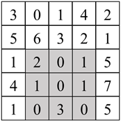

# 第二章：数组

## 面试题6：排序数组中两个数字之和
### 题目
输入一个递增排序的数组和一个值k，请问如何在数组中找出两个和为k的数字并返回它们的下标？假设数组中存在且只存在一对符合条件的数字，同时一个数字不能使用两次。例如输入数组[1, 2, 4, 6, 10]，k的值为8，数组中的数字2和6的和为8，它们的下标分别为1和3。

### 参考代码
``` java
public int[] twoSum(int[] numbers, int target) {
    int i = 0;
    int j = numbers.length - 1;
    while (i < j && numbers[i] + numbers[j] != target) {
        if (numbers[i] + numbers[j] < target) {
            i++;
        } else {
            j--;
        }
    }

    return new int[] {i, j};
}
```

## 面试题7：数组中和为0的三个数字
### 题目
输入一个数组，如何找出数组中所有和为0的三个数字的三元组？注意返回值中不得包含重复的三元组。例如在数组中[-1, 0, 1, 2, -1, -4]中有两个三元组的和为0，它们分别是[-1, 0, 1]和[-1, -1, 2]。

### 参考代码
``` java
public List<List<Integer>> threeSum(int[] nums) {
    List<List<Integer>> result = new LinkedList<List<Integer>>();
    if (nums.length >= 3) {
        Arrays.sort(nums);

        int i = 0;
        while(i < nums.length - 2) {
            twoSum(nums, i, result);

            int temp = nums[i];
            while(i < nums.length && nums[i] == temp) {
                ++i;
            }
        }
    }

    return result;
}

private void twoSum(int[] nums, int i, List<List<Integer>> result) {
    int j = i + 1;
    int k = nums.length - 1;
    while (j < k) {
        if (nums[i] + nums[j] + nums[k] == 0) {
            result.add(Arrays.asList(nums[i], nums[j], nums[k]));

            int temp = nums[j];
            while (nums[j] == temp && j < k) {
                ++j;
            }
        } else if (nums[i] + nums[j] + nums[k] < 0) {
            ++j;
        } else {
            --k;
        }
    }
}
```

## 面试题8：和大于等于k的最短子数组
### 题目
输入一个正整数组成的数组和一个正整数k，请问数组中和大于或等于k的连续子数组的最短长度是多少？如果不存在所有数字之和大于k的子数组，则返回0。例如输入数组[5, 1, 4, 3]，k的值为7，和大于或等于7的最短连续子数组是[4, 3]，因此输出它的长度2。

### 参考代码
``` java
public int minSubArrayLen(int k, int[] nums) {
    int left = 0;
    int sum = 0;
    int minLength = Integer.MAX_VALUE;
    for (int right = 0; right < nums.length; right++) {
        sum += nums[right];
        while (left <= right && sum >= k) {
            minLength = Math.min(minLength, right - left + 1);
            sum -= nums[left++];
        }
    }

    return minLength == Integer.MAX_VALUE ? 0 : minLength;
}
```

## 面试题9：乘积小于k的子数组
### 题目
输入一个由正整数组成的数组和一个正整数k，请问数组中有多少个数字乘积小于k的连续子数组？例如输入数组[10, 5, 2, 6]，k的值为100，有8个子数组的所有数字的乘积小于100，它们分别是[10]、[5]、[2]、[6]、[10, 5]、[5, 2]、[2, 6]和[5, 2, 6]。

### 参考代码
``` java
public int numSubarrayProductLessThanK(int[] nums, int k) {
    long product = 1;
    int left = 0;
    int count = 0;
    for (int right = 0; right < nums.length; ++right) {
        product *= nums[right];
        while (left <= right && product >= k) {
            product /= nums[left];
            left++;
        }

        count += right >= left ? right - left + 1 : 0;
    }

    return count;
}
```

## 面试题10：和为k的子数组
题目：输入一个整数数组和一个整数k，请问数组中有多少个数字之和等于k的连续子数组？例如输入数组[1, 1, 1]，k的值为2，有2个连续子数组之和等于2。

### 参考代码
``` java
public int subarraySum(int[] nums, int k) {
    Map<Integer, Integer> sumToCount = new HashMap<>();
    sumToCount.put(0, 1);
    int sum = 0;
    int count = 0;
    for (int num : nums) {
        sum += num;
        count += sumToCount.getOrDefault(sum - k, 0);
        sumToCount.put(sum, sumToCount.getOrDefault(sum, 0) + 1);
    }

    return count;
}
```

## 面试题11：0和1个数相同的子数组
### 题目
输入一个只包含0和1的数组，请问如何求最长0和1的个数相同的连续子数组的长度？例如在数组[0, 1, 0]中有两个子数组包含相同个数的0和1，分别是[0, 1]和[1, 0]，它们的长度都是2，因此输出2。

### 参考代码
``` java
public int findMaxLength(int[] nums) {
    Map<Integer, Integer> sumToIndex = new HashMap();
    sumToIndex.put(0, -1);
    int sum = 0;
    int maxLength = 0;
    for (int i = 0; i < nums.length; ++i) {
        sum += nums[i] == 0 ? -1 : 1;
        if (sumToIndex.containsKey(sum)) {
            maxLength = Math.max(maxLength, i - sumToIndex.get(sum));
        } else {
            sumToIndex.put(sum, i);
        }
    }

    return maxLength;
}
```

## 面试题12：左右两边子数组的和相等
### 题目
输入一个整数数组，如果一个数字左边的子数组数字之和等于右边的子数组数字之和，请返回该数字的下标。如果存在多个这样的数字，则返回最左边一个的下标。如果不存在这样的数字，则返回-1。例如在数组[1, 7, 3, 6, 2, 9]中，下标为3的数字（值为6）左边三个数字1、7、3和右边两个数字2和9的和相等，都是11，因此正确的输出值是3。

### 参考代码
``` java
public int pivotIndex(int[] nums) {
    int total = 0;
    for (int num : nums) {
        total += num;
    }

    int sum = 0;
    for (int i = 0; i < nums.length; ++i) {
        sum += nums[i];
        if (sum - nums[i] == total - sum) {
            return i;
        }
    }

    return -1;
}
```

## 面试题13：二维子矩阵的和
### 题目
输入一个二维矩阵，如何计算给定左上角坐标和右下角坐标的子矩阵数字之和？对同一个二维矩阵，计算子矩阵数字之和的函数可能输入不同的坐标而被反复调用多次。例如输入图2.1中的二维矩阵，以及左上角坐标为(2, 1)和右下角坐标为(4, 3)，该函数输出8。
 


图2.1：在一个5×5的二维数组中左上角坐标为(2, 1)、右下角坐标为(4, 3)的子矩阵（有灰色背景部分）的和等于8。

### 参考代码
``` java
class NumMatrix {
    private int[][] sums;
 
    public NumMatrix(int[][] matrix) {
        if (matrix.length == 0 || matrix[0].length == 0) {
            return;
        }
        
        sums = new int[matrix.length + 1][matrix[0].length + 1];
        for (int i = 0; i < matrix.length; ++i) {
            int rowSum = 0;
            for (int j = 0; j < matrix[0].length; ++j) {
                rowSum += matrix[i][j];
                sums[i + 1][j + 1] = sums[i][j + 1] + rowSum;
            }
        }
    }
    
    public int sumRegion(int row1, int col1, int row2, int col2) {
        return sums[row2 + 1][col2 + 1] - sums[row1][col2 + 1]
            - sums[row2 + 1][col1] + sums[row1][col1]; 
    }
}
```
