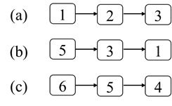

# 第四章：链表
## 面试题21：删除倒数第k个结点
### 题目
给你一个链表，请问如何删除链表中的倒数第k个结点？假设链表中结点的总数为n，那么1≤k≤n。要求只能遍历链表一次。
例如输入图4.1中（a）的链表，删除倒数第2个结点之后的链表如图4.1中（b）所示。
 


图4.1：从链表中删除倒数第2个结点。（a）一个包含6个结点的链表。（b）删除倒数第2个结点（值为5的结点）之后的链表。

### 参考代码
``` java
public ListNode removeNthFromEnd(ListNode head, int n) {
    ListNode dummy = new ListNode(0);
    dummy.next = head;

    ListNode front = head, back = dummy;
    for (int i = 0; i < n; i++) {
        front = front.next;
    }

    while (front != null) {
        front = front.next;
        back = back.next;
    }

    back.next = back.next.next;                    
    return dummy.next;
}
```

## 面试题22：链表中环的入口结点
### 题目
一个链表中包含环，如何找出环的入口结点？从链表的头结点开始沿着next指针进入环的第一个结点为环的入口结点。例如，在图4.3的链表中，环的入口结点是结点3。
 


图4.3：结点3是链表中环的入口结点

### 参考代码
``` java
public ListNode detectCycle(ListNode head) {
    ListNode inLoop = getNodeInLoop(head);
    if (inLoop == null) {
        return null;
    }

    ListNode node = head;
    while (node != inLoop) {
        node = node.next;
        inLoop = inLoop.next;
    }

    return node;
}

private ListNode getNodeInLoop(ListNode head) {
    if (head == null || head.next == null) {
        return null;
    }

    ListNode slow = head.next;
    ListNode fast = slow.next;
    while (slow != null && fast != null) {
        if (slow == fast)
            return slow;

        slow = slow.next;
        fast = fast.next;
        if (fast != null)
            fast = fast.next;
    }

    return null;
}
```

## 面试题23：两个链表的第一个重合结点
### 题目
输入两个单向链表，请问如何找出它们的第一个重合结点。例如图4.5中的两个链表的第一个重合的结点的值是4。
 


图4.5：两个部分重合的链表，它们的第一个重合的结点的值是4。

### 参考代码
``` java
public ListNode getIntersectionNode(ListNode headA, ListNode headB) {
    int count1 = countList(headA);
    int count2 = countList(headB);
    int delta = Math.abs(count1 - count2);
    ListNode longer = count1 > count2 ? headA : headB;
    ListNode shorter = count1 > count2 ? headB : headA;
    ListNode node1 = longer;
    for (int i = 0; i < delta; ++i) {
        node1 = node1.next;
    }

    ListNode node2 = shorter;
    while (node1 != node2) {
        node2 = node2.next;
        node1 = node1.next;
    }

    return node1;
}

private int countList(ListNode head) {
    int count = 0;
    while (head != null) {
        count++;
        head = head.next;
    }

    return count;
}
```

## 面试题24：反转链表
### 题目
定义一个函数，输入一个链表的头结点，反转该链表并输出反转后链表的头结点。例如，把图4.8（a）中的链表反转之后得到的链表如图4.8（b）所示。
 


图4.8：反转一个链表。（a）一个含有5个结点的链表。（b）反转之后的链表。

### 参考代码
``` java
public ListNode reverseList(ListNode head) {
    ListNode prev = null;
    ListNode cur = head;    
    while (cur != null) {
        ListNode next = cur.next;
        cur.next = prev;
        prev = cur;
        cur = next;
    }

    return prev;
}
```

## 面试题25：链表中的数字相加
### 题目
给你两个表示非负整数的单向链表，请问如何实现这两个整数的相加并且把和仍然用单向链表表示？链表中的每个结点表示整数十进制的一位，并且头结点对应整数的最高位数而尾结点对应整数的个位数。例如在图4.10（a）和（b）中的两个链表分别表示整数123和531，它们的和为654，对应的链表尾图4.10的（c）所示。
 


图4.10：链表中数字以及它们的和。（a）表示整数123的链表。（b）表示整数531的链表。（c）表示123与531的和654的链表。

### 参考代码
``` java
public ListNode addTwoNumbers(ListNode head1, ListNode head2) {
    head1 = reverseList(head1);
    head2 = reverseList(head2);
    ListNode reversedHead = addReversed(head1, head2);
    return reverseList(reversedHead);
}

private ListNode addReversed(ListNode head1, ListNode head2) {
    ListNode dummy = new ListNode(0);
    ListNode sumNode = dummy;
    int carry = 0;
    while (head1 != null || head2 != null) {
        int sum = (head1 == null ? 0 : head1.val)
                + (head2 == null ? 0 : head2.val) + carry;
        carry = sum >= 10 ? 1 : 0;
        sum = sum >= 10 ? sum - 10 : sum;        
        ListNode newNode = new ListNode(sum);

        sumNode.next = newNode;            
        sumNode = sumNode.next;

        head1 = head1 == null ? null : head1.next;
        head2 = head2 == null ? null : head2.next;
    }

    if (carry > 0) {
        sumNode.next = new ListNode(carry);
    }

    return dummy.next;
}

private ListNode reverseList(ListNode head) {
    ListNode reversedHead = null;
    ListNode prev = null;
    ListNode cur = head;    
    while (cur != null) {
        ListNode next = cur.next;
        if (next == null)
            reversedHead = cur;

        cur.next = prev;
        prev = cur;
        cur = next;
    }

    return reversedHead;
}
```

## 面试题26：重排链表
### 题目
给你一个链表，链表中结点的顺序是L0→ L1→ L2→…→ Ln-1→ Ln，请问如何重排链表使得结点的顺序变成L0→ Ln→ L1→ Ln-1→ L2→ Ln-2→…？例如输入图4.12（a）中的链表，重排之后的链表如图4.12（b）所示。
 


图4.12：重排链表。（a）一个含有6个结点的链表。（b）重排之后的链表。

### 参考代码
``` java
public void reorderList(ListNode head) {
    ListNode dummy = new ListNode(0);
    dummy.next = head;        
    ListNode fast = dummy;
    ListNode slow = dummy;
    while (fast != null && fast.next != null) {
        slow = slow.next;
        fast = fast.next;
        if (fast.next != null) {
            fast = fast.next;
        }            
    }

    ListNode temp = slow.next;
    slow.next = null;
    link(head, reverseList(temp), dummy);
}

private void link(ListNode node1, ListNode node2, ListNode head) {
    ListNode prev = head;
    while (node1 != null && node2 != null) {
        ListNode temp = node1.next;

        prev.next = node1;
        node1.next = node2;
        prev = node2;

        node1 = temp;
        node2 = node2.next;
    }

    if (node1 != null) {
        prev.next = node1;
    }
}

private ListNode reverseList(ListNode first) {
    ListNode prev = null;
    ListNode cur = first;
    ListNode head = null;
    while (cur != null) {
        ListNode next = cur.next;
        cur.next = prev;
        if (next == null) {
            head = cur;
        }

        prev = cur;
        cur = next;
    }

    return head;
}
```

## 面试题27：回文链表
### 题目
如何判断一个链表是不是回文？要求解法的时间复杂度是O(n)，另外不得使用超过O(1)的辅助空间。如果一个链表是回文，那么链表中结点序列从前往后看和从后往前看是相同的。例如，图4.13中的链表的结点序列从前往后看和从后往前看都是1、2、3、3、2、1，因此这是一个回文链表。
 


图4.13：一个回文链表。

### 参考代码
``` java
public boolean isPalindrome(ListNode head) {
    if (head == null || head.next == null) {
        return true;
    }

    ListNode slow = head;
    ListNode fast = head.next;
    while (fast.next != null && fast.next.next != null) {
        fast = fast.next.next;
        slow = slow.next;
    }

    ListNode secondHalf = slow.next;
    if (fast.next != null) {
        secondHalf = slow.next.next;
    }

    slow.next = null;
    return equals(secondHalf, reverseList(head));
}

public ListNode reverseList(ListNode head) {
    ListNode reversedHead = null;
    ListNode prev = null;
    ListNode cur = head;    
    while (cur != null) {
        ListNode next = cur.next;
        if (next == null) {
            reversedHead = cur;
        }

        cur.next = prev;
        prev = cur;
        cur = next;
    }

    return reversedHead;
}
```

## 面试题28：展平多级双向链表
### 题目
在一个多级双向链表中节点除了有两个指针分别指向前后两个节点之外，还有一个指针指向它的子链表，并且子链表也是一个双向链表，它的节点也有指向子链表的指针。请将这样的多级双向链表展平成普通的双向链表，即所有节点都没有子链表。例如图4.14（a）是一个多级双向链表，它展平之后如图4.14（b）所示。
 


图4.14：展平多级双向链表。（a）一个多级双向链表。（b）展平之后的双向链表。

### 参考代码
``` java
public Node flatten(Node head) {
    flattenGetTail(head);
    return head;
}

private Node flattenGetTail(Node head) {
    Node node = head;
    Node tail = null;
    while (node != null) {
        Node next = node.next;
        if (node.child != null) {
            Node child = node.child;
            Node childTail = flattenGetTail(node.child);

            node.child = null;
            node.next = child;
            child.prev = node;
            childTail.next = next;
            if (next != null) {
                next.prev = childTail;
            }

            tail = childTail;
        } else {
            tail = node;                
        }

        node = next;
    }

    return tail;
}
```

## 面试题29：排序的循环链表
### 题目
在一个循环链表中节点的值递增排序，请设计一个算法往该循环链表中插入节点，并保证插入节点之后的循环链表仍然是排序的。例如图4.15（a）是一个排序的循环链表，插入一个值为4的节点之后的链表如图4.15（b）所示。
 


图4.15：往排序的循环链表中插入节点。（a）一个值分别为1、2、3、5、6的循环链表。（b）往链表中插入值为4的节点。

### 参考代码
``` java
public Node insert(Node head, int insertVal) {
    Node node = new Node(insertVal);
    if (head == null) {
        head = node;
        head.next = head;
    } else if (head.next == head) {
        head.next = node;
        node.next = head;
    } else {
        insertCore(head, node);
    }

    return head;
}

private void insertCore(Node head, Node node) {
    Node cur = head;
    Node next = head.next;
    Node biggest = head;
    while (!(cur.val <= node.val && next.val >= node.val)
            && next != head) {
        cur = next;
        next = next.next;
        if (cur.val >= biggest.val)
            biggest = cur;
    }

    if (cur.val <= node.val && next.val >= node.val) {
        cur.next = node;
        node.next = next;
    } else {
        node.next = biggest.next;
        biggest.next = node;
    }
}    
```
