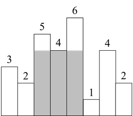
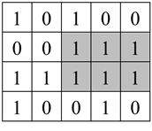

# 第六章：栈
## 面试题36：后缀表达式
### 题目
后缀表达式是一种算术表达式，它的操作符在操作数的后面。输入一个用字符串数组表示的后缀表达式，请输出该后缀表达式的计算结果。假设输入的一定是有效的后缀表达式。例如，后缀表达式["2", "1", "3", "*", "+"]对应的算术表达式是“2 + 1 * 3”，因此输出它的计算结果5。

### 参考代码
``` java
public int evalRPN(String[] tokens) {
    Stack<Integer> stack = new Stack<Integer>();
    for (String token : tokens) {
        switch (token) {
            case "+":
            case "-":
            case "*":
            case "/":
                int num1 = stack.pop();
                int num2 = stack.pop();
                stack.push(calculate(num2, num1, token));
                break;
            default:
                stack.push(Integer.parseInt(token));
        }
    }

    return stack.pop();
}

private int calculate(int num1, int num2, String operator) {
    switch (operator) {
        case "+":
            return num1 + num2;
        case "-":
            return num1 - num2;
        case "*":
            return num1 * num2;
        case "/":
            return num1 / num2;
        default:
            return 0;
    }
}
```

## 面试题37：小行星碰撞
### 题目
输入一个表示小行星的数组，数组中每个数字的绝对值表示小行星的大小，数字的正负号表示小行星运动的方向，正号表示向右飞行，负号表示向左飞行。如果两个小行星相撞，体积较小的小行星将会爆炸最终消失，体积较大的小行星不受影响。如果相撞的两个小行星大小相同，它们都会爆炸。飞行方向相同的小行星永远不会相撞。求最终剩下的小行星。例如，假如有六个小行星[4, 5, -6, 4, 8, -5]（如图6.2所示），它们相撞之后最终剩下三个小行星[-6, 4, 8]。
 


图6.2：用数组[4, 5, -6, 4, 8, -5]表示的六个小行星。箭头表示飞行的方向。

### 参考代码
``` java
public int[] asteroidCollision(int[] asteroids) {
    Stack<Integer> stack = new Stack<>();
    for (int as : asteroids) {
        while (!stack.empty() && stack.peek() > 0 && stack.peek() < -as) {
            stack.pop();
        }

        if (!stack.empty() && as < 0 && stack.peek() == -as) {
            stack.pop();
        } else if (as > 0 || stack.empty() || stack.peek() < 0) {
            stack.push(as);
        }
    }

    return stack.stream().mapToInt(i->i).toArray();
}
```

## 面试题38：每日温度
### 题目
输入一个数组，它的每个数字是某天的温度。请计算在每一天需要等几天才会有更高的温度。例如，如果输入数组[35, 31, 33, 36, 34]，那么输出为[3, 1, 1, 0, 0]。由于第一天的温度是35，要等3天才会有更高的温度36，因此对应的输出为3。第四天的温度是36，后面没有更高的温度，它对应的输出是0。

### 参考代码
``` java
public int[] dailyTemperatures(int[] temperatures) {
    int[] result = new int[temperatures.length];        
    Stack<Integer> stack = new Stack<>();
    for (int i = 0; i < temperatures.length; i++) {
        while (!stack.empty()
            && temperatures[i] > temperatures[stack.peek()]) {
            int prev = stack.pop();
            result[prev] = i - prev;
        }

        stack.push(i);
    }

    return result;
}
```

## 面试题39：直方图最大矩形面积
### 题目
直方图是由排列在同一基线上的相邻柱子组成的图形。输入一个由非负数组成的数组，数组中的数字是直方图宽为1的柱子的高。求直方图中最大矩形的面积。例如，输入数组[3, 2, 5, 4, 6, 1, 4, 2]，它对应的直方图如图6.3所示。该直方图中最大的矩形的面积为12，如阴影部分所示。
 


图6.3：柱子高度分别为[3, 2, 5, 4, 6, 1, 4, 2]的直方图，其中最大的矩形的面积是12，如阴影部分所示。

### 参考代码
#### 解法一
``` java
public int largestRectangleArea(int[] heights) {
    int maxArea = 0;
    for (int i = 0; i < heights.length; i++) {
        int min = heights[i];
        for (int j = i; j < heights.length; j++) {
            min = Math.min(min, heights[j]);
            int area = min * (j - i + 1);
            maxArea = Math.max(maxArea, area);
        }
    }

    return maxArea;
}
```

#### 解法二
``` java
public int largestRectangleArea(int[] heights) {
    if (heights.length == 0) {
        return 0;
    }

    return helper(heights, 0, heights.length);
}

private int helper(int[] heights, int start, int end) {
    if (start == end) {
        return 0;
    }

    if (start + 1 == end) {
        return heights[start];
    }

    int minIndex = start;
    for (int i = start + 1; i < end; i++) {
        if (heights[i] < heights[minIndex]) {
            minIndex = i;
        }
    }

    int area = (end - start) * heights[minIndex];
    int left = helper(heights, start, minIndex);
    int right = helper(heights, minIndex + 1, end);

    area = Math.max(area, left);
    return Math.max(area, right);
}
```

#### 解法三
``` java
public int largestRectangleArea(int[] heights) {
    Stack<Integer> stack = new Stack<>();
    stack.push(-1);

    int maxArea = 0;
    for (int i = 0; i < heights.length; i++) {
        while (stack.peek() != -1
            && heights[stack.peek()] >= heights[i]) {
            int height = heights[stack.pop()];
            int width = i - stack.peek() - 1;
            maxArea = Math.max(maxArea, height * width);
        }

        stack.push(i);
    }

    while (stack.peek() != -1) {
        int height = heights[stack.pop()];
        int width = heights.length - stack.peek() - 1;
        maxArea = Math.max(maxArea, height * width);
    }

    return maxArea;
}
```

## 面试题40：矩阵中最大的矩形
### 题目
请在一个由0、1组成的矩阵中找出最大的只包含1的矩形并输出它的面积。例如在图6.6的矩阵中，最大的只包含1的矩阵如阴影部分所示，它的面积是6。
 


图6.6：一个由0、1组成的矩阵，其中只包含1的最大矩形的面积为6，如阴影部分所示。

### 参考代码
``` java
public int maximalRectangle(char[][] matrix) {
    if (matrix.length == 0 || matrix[0].length == 0) {
        return 0;
    }

    int[] heights = new int[matrix[0].length];
    int maxArea = 0;
    for(char[] row : matrix) {
        for (int i = 0; i < row.length; i++) {
            if (row[i] == '0') {
                heights[i] = 0;
            } else {
                heights[i]++;
            }
        }

        maxArea = Math.max(maxArea, largestRectangleArea(heights));
    }

    return maxArea;
}    

public int largestRectangleArea(int[] heights) {
    Stack<Integer> stack = new Stack<>();
    stack.push(-1);

    int maxArea = 0;
    for (int i = 0; i < heights.length; i++) {
        while (stack.peek() != -1
            && heights[stack.peek()] >= heights[i]) {
            int height = heights[stack.pop()];
            int width = i - stack.peek() - 1;
            maxArea = Math.max(maxArea, height * width);
        }

        stack.push(i);
    }

    while (stack.peek() != -1) {
        int height = heights[stack.pop()];
        int width = heights.length - stack.peek() - 1;
        maxArea = Math.max(maxArea, height * width);
    }

    return maxArea;
}
```
