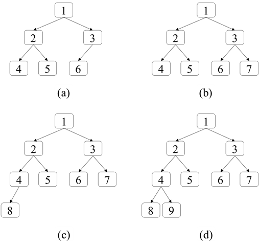
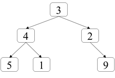
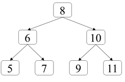
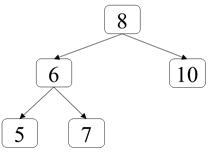

# 第七章：队列
## 面试题41：滑动窗口的平均值
### 题目
请实现如下类型MovingAverage计算滑动窗口里所有数字的平均值，该类型构造函数的参数确定滑动窗口的大小，成员函数next每次调用的时候都会往滑动窗口添加一个整数，并返回滑动窗口里所有数字的平均值。
``` java
class MovingAverage {    
    public MovingAverage(int size);
    public double next(int val);
}
```
例如当滑动窗口的大小为3时，第一次调用next函数往滑动窗口里添加整数1，此时窗口里只有一个数字1，因此返回平均值1。再次调用next函数添加整数2，此时窗口里有两个数字1和2，因此返回平均值1.5。第三次调用next函数添加数字3，此时有三个数字1、2、3，因此返回平均值2。第四次调用next函数添加数字4，由于受到窗口大小的限制滑动窗口最多只能由三个数字，因此第一个数字1将滑出窗口，因此窗口里包含三个数字2、3、4，返回平均值3。

### 参考代码
``` java
class MovingAverage {    
    private Queue<Integer> nums;
    private int capacity;
    private int sum;

    public MovingAverage(int size) {
        nums = new LinkedList<>();
        capacity = size;
    }
    
    public double next(int val) {
        nums.offer(val);
        sum += val;
        if (nums.size() > capacity) {
            sum -= nums.poll();
        }
        
        return (double)sum / nums.size();
    }
}
```

## 面试题42：最近请求次数
### 题目
请实现如下类型RecentCounter，它是统计过去3000毫秒内的请求次数的计数器。该类型的构造函数RecentCounter()初始化计数器，请求数为0；函数ping(int t)在在时间t添加一个新请求（t表示以毫秒为单位的时间），并返回过去3000毫秒内（时间范围为[t-3000, t]）发生的所有请求数。假设每次调用函数ping时参数t都比之前调用时的参数值大。
``` java
class RecentCounter {    
    public RecentCounter();
    public int ping(int t);
}
```
例如，在初始化一个RecentCounter计数器之后，ping(1)的返回值是1，因为时间范围[-2999, 1]只有1个请求；ping(10)的返回值是2，因为时间范围[-2990, 10]有2个请求；ping(3001)的返回值是3，因为时间范围[1, 3001]有3个请求；ping(3002)的是3，因为时间范围[2, 3002]只有两个请求，发生在时间1的请求已经不在这个时间范围了。

### 参考代码
``` java
class RecentCounter {
    private Queue<Integer> times;
    private int windowSize;
    
    public RecentCounter() {
        times = new LinkedList<>();
        windowSize = 3000;
    }
    
    public int ping(int t) {
        times.offer(t);
        while (times.peek() + windowSize < t) {
            times.poll();
        }
        
        return times.size();
    }
}
```

## 面试题43：往完全二叉树添加节点
### 题目
在完全二叉树里，除了最后一层之外其他层的节点都是满的（第n层有2n-1个节点）。最后一层的节点可能不满，该层所有的节点尽可能向左边靠拢。例如图7.3（a）、（b）、（c）三个二叉树均为完全二叉树。请实现数据结构CBTInserter的三个方法，往完全二叉树里添加节点：
+ 构造函数CBTInserter(TreeNode root)，用一个完全二叉树的根节点初始化该数据结构。
+ 函数CBTInserter.insert(int v)往完全二叉树里添加一个值为v的节点，并返回被插入节点的父节点。例如往图7.3（a）的完全二叉树里添加一个值为7的节点之后，二叉树如图7.3（b）所示，并返回节点3。往图7.3（b）的完成二叉树里添加一个值为8的节点之和，二叉树如图7.3（c）所示，并返回节点4。往7.3（c）中的完全二叉树中添加节点9得到7.3（d），并返回节点4。
+ 函数CBTInserter.get_root()返回完全二叉树的根节点。
 


图7.3：四个完全二叉树。往（a）中的完全二叉树中添加节点7得到（b）；往（b）中的完全二叉树中添加节点8得到（c）；往（c）中的完全二叉树中添加节点9得到（d）。
### 参考代码
``` java
class CBTInserter {    
    private Queue<TreeNode> queue;
    private TreeNode root;

    public CBTInserter(TreeNode root) {
        this.root = root;
        
        queue = new LinkedList<>();
        queue.offer(root);
        while (queue.peek().left != null && queue.peek().right != null) {
            TreeNode node = queue.poll();
            queue.offer(node.left);
            queue.offer(node.right);
        }
    }
    
    public int insert(int v) {
        TreeNode parent = queue.peek();
        TreeNode node = new TreeNode(v);
        
        if (parent.left == null) {
            parent.left = node;
        } else {
            parent.right = node;
            
            queue.poll();
            queue.offer(parent.left);
            queue.offer(parent.right);
        }
        
        return parent.val;
    }
    
    public TreeNode get_root() {
        return root;
    }
}
```

## 面试题44：二叉树每层的最大值
### 题目
输入一棵二叉树，请找出二叉树中每一层的最大值。例如输入图7.4中的二叉树，返回三层节点的最大值[3, 4, 9]。
 


图7.4：一棵二叉树，第一层的最大值是3，第二层的最大值是4，第三层的最大值是9。

### 参考代码
``` java
public List<Integer> largestValues(TreeNode root) {
    int current = 0;
    int next = 0;
    Queue<TreeNode> queue = new LinkedList<>();
    if (root != null) {
        queue.offer(root);
        current = 1;
    }

    List<Integer> result = new LinkedList<>();
    int max = Integer.MIN_VALUE;
    while (!queue.isEmpty()) {
        TreeNode node = queue.poll();
        current--;
        max = Math.max(max, node.val);

        if (node.left != null) {
            queue.offer(node.left);
            next++;
        }

        if (node.right != null) {
            queue.offer(node.right);
            next++;
        }

        if (current == 0) {
            result.add(max);
            max = Integer.MIN_VALUE;
            current = next;
            next = 0;
        }
    }
    return result;
}
```

## 面试题45：二叉树最底层最左边的值
### 题目
如何在一个二叉树中找出它最底层中最左边节点的值？假设二叉树中最少有一个节点。例如在图7.5中的二叉树中最底层节点中最左边一个节点的值是5。
 


图7.5：一棵二叉树，最底层最左边的节点的值是5。

### 参考代码
``` java
public int findBottomLeftValue(TreeNode root) {
    Queue<TreeNode> queue1 = new LinkedList<>();
    Queue<TreeNode> queue2 = new LinkedList<>();
    queue1.offer(root);
    int bottomLeft = root.val;
    while(!queue1.isEmpty()) {
        TreeNode node = queue1.poll();
        if (node.left != null) {
            queue2.offer(node.left);
        }

        if (node.right != null) {
            queue2.offer(node.right);
        }

        if (queue1.isEmpty()) {
            queue1 = queue2;
            queue2 = new LinkedList<>();
            if (!queue1.isEmpty()) {
                bottomLeft = queue1.peek().val;
            }
        }
    }

    return bottomLeft;
}
```

## 面试题46：二叉树的右侧视图
### 题目
给你一个二叉树，想象你站在该二叉树的右侧，从上到下你看到的节点构成二叉树的右侧试图。例如图7.6中的二叉树的右侧视图包含8、10、7三个节点。请写一个函数返回二叉树的右侧视图节点的值。
 

 
图7.6：一棵二叉树，它的右侧视图包含值分别为8、10、7三个节点。

### 参考代码
``` java
public List<Integer> rightSideView(TreeNode root) {
    List<Integer> view = new LinkedList<Integer>();
    if (root == null) {
        return view;
    }

    Queue<TreeNode> queue1 = new LinkedList<>();
    Queue<TreeNode> queue2 = new LinkedList<>();
    queue1.offer(root);
    while (!queue1.isEmpty()) {
        TreeNode node = queue1.poll();

        if (node.left != null) {
            queue2.offer(node.left);
        }

        if (node.right != null) {
            queue2.offer(node.right);
        }

        if (queue1.isEmpty()) {
            view.add(node.val);
            queue1 = queue2;
            queue2 = new LinkedList<>();
        }
    }

    return view;
}
```
