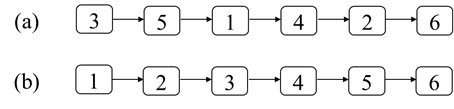
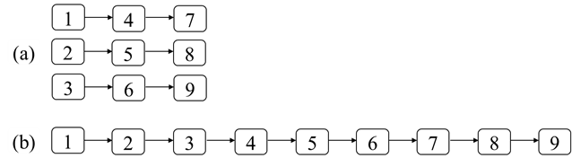

# 第十二章：排序
## 面试题74：合并区间
### 题目
输入一个区间的集合，请将重叠的区间合并。每个区间用两个数字比较，分别表示区间的起始和结束位置。例如，输入区间[[1, 3], [4, 5], [8, 10], [2, 6], [9, 12], [15, 18]]，合并重叠的区间之后得到[[1, 6], [8, 12], [15, 18]]。

### 参考代码
``` java
public int[][] merge(int[][] intervals) {
    Arrays.sort(intervals, (i1, i2) -> i1[0] - i2[0]);

    List<int[]> merged = new LinkedList<>();
    int i = 0;
    while (i < intervals.length) {
        int[] temp = new int[] {intervals[i][0], intervals[i][1]};
        int j = i + 1;
        while (j < intervals.length && intervals[j][0] <= temp[1]) {
            temp[1] = Math.max(temp[1], intervals[j][1]);
            j++;
        }

        merged.add(temp);
        i = j;
    }

    int[][] result = new int[merged.size()][];
    return merged.toArray(result);
}
```

## 面试题75：数组相对排序
### 题目
输入两个数组arr1和arr2，其中arr2里的每个数字都唯一并且也都是arr1中的数字。请将arr1中的数字按照arr2中数字的相对顺序排序。如果arr1中的数字在arr2中没有出现，那么将这些数字按递增的顺序排在后面。假设数组中的所有数字都在0到1000的范围内。例如，输入的数组arr1和arr2分别是[2, 3, 3, 7, 3, 9, 2, 1, 7, 2]和[3, 2, 1]，则arr1排序之后为[3, 3, 3, 2, 2, 2, 1, 7, 7, 9]。

### 参考代码
``` java
public int[] relativeSortArray(int[] arr1, int[] arr2) {
    int[] counts = new int[1001];
    for (int num : arr1) {
        counts[num]++;
    }

    int i = 0;
    for (int num : arr2) {
        while (counts[num] > 0) {
            arr1[i++] = num;
            counts[num]--;
        }
    }

    for (int num = 0; num < counts.length; num++) {
        while (counts[num] > 0) {
            arr1[i++] = num;
            counts[num]--;
        }
    }

    return arr1;
}
```

## 面试题76：数组中第k大的数字
### 题目
请从一个乱序的数组中找出第k大的数字。例如数组[3, 1, 2, 4, 5, 5, 6]中第3大的数字是5。

### 参考代码
``` java
public int findKthLargest(int[] nums, int k) {
    int target = nums.length - k;
    int start = 0;
    int end = nums.length - 1;
    int index = partition(nums, start, end);
    while (index != target) {
        if (index > target) {
            end = index - 1;
        } else {
            start = index + 1;
        }

        index = partition(nums, start, end);
    }

    return nums[index];
}

private int partition(int[] nums, int start, int end) {
    int random = new Random().nextInt(end - start + 1) + start;
    swap(nums, random, end);

    int small = start - 1;
    for (int i = start; i < end; ++i) {
        if (nums[i] < nums[end]) {
            small++;
            swap(nums, i, small);
        }
    }

    small++;
    swap(nums, small, end);

    return small;
}

private void swap(int[] nums, int index1, int index2) {
    if (index1 != index2) {
        int temp = nums[index1];
        nums[index1] = nums[index2];
        nums[index2] = temp;
    }
}
```

## 面试题77：链表排序
### 题目
输入一个链表的头节点，请将该链表排序。例如，输入图12.4（a）中的链表，该链表排序后如图12.4（b）所示。
 


图12.4：链表排序。（a）一个有6个结点的链表。（b）排序后的链表。

### 参考代码
``` java
public ListNode sortList(ListNode head) {
    if (head == null || head.next == null) {
        return head;
    }

    ListNode head1 = head;
    ListNode head2 = split(head);

    head1 = sortList(head1);
    head2 = sortList(head2);

    return merge(head1, head2);
}

private ListNode split(ListNode head) {
    ListNode slow = head;
    ListNode fast = head.next;
    while (fast != null && fast.next != null) {
        slow = slow.next;
        fast = fast.next.next;
    }

    ListNode second = slow.next;
    slow.next = null;

    return second;
}

private ListNode merge(ListNode head1, ListNode head2) {
    ListNode dummy = new ListNode(0);
    ListNode cur = dummy;
    while (head1 != null && head2 != null) {
        if (head1.val < head2.val) {
            cur.next = head1;
            head1 = head1.next;
        } else {
            cur.next = head2;
            head2 = head2.next; 
        }

        cur = cur.next;
    }

    cur.next = head1 == null ? head2 : head1;

    return dummy.next;
}
```

## 面试题78：合并排序链表
### 题目
输入k个排序的链表，请将它们合并成一个排序的链表。例如，输入三个排序的链表如图12.5（a）所示，将它们合并之后得到的排序的链表如图12.5（b）所示。



图12.5：合并排序链表。（a）三个排序的链表。（b）合并后的链表。

### 参考代码
#### 解法一
``` java
public ListNode mergeKLists(ListNode[] lists) {
    ListNode dummy = new ListNode(0);
    ListNode cur = dummy;

    PriorityQueue<ListNode> minHeap = new PriorityQueue<>((n1, n2) 
        -> n1.val - n2.val);
    for (ListNode list : lists) {
        if (list != null) {
            minHeap.offer(list);
        }
    }

    while (!minHeap.isEmpty()) {
        ListNode least = minHeap.poll();
        cur.next = least;
        cur = least;

        if (least.next != null) {
            minHeap.offer(least.next);
        }
    }

    return dummy.next;
}
```
 
#### 解法二
``` java
public ListNode mergeKLists(ListNode[] lists) {
    if (lists.length == 0) {
        return null;
    }

    return mergeLists(lists, 0, lists.length);
}

private ListNode mergeLists(ListNode[] lists, int start, int end) {
    if (start + 1 == end) {
        return lists[start];
    }

    int mid = (start + end) / 2;
    ListNode head1 = mergeLists(lists, start, mid);
    ListNode head2 = mergeLists(lists, mid, end);
    return merge(head1, head2);
}

private ListNode merge(ListNode head1, ListNode head2) {
    ListNode dummy = new ListNode(0);
    ListNode cur = dummy;
    while (head1 != null && head2 != null) {
        if (head1.val < head2.val) {
            cur.next = head1;
            head1 = head1.next;
        } else {
            cur.next = head2;
            head2 = head2.next; 
        }

        cur = cur.next;
    }

    cur.next = head1 == null ? head2 : head1;
    return dummy.next;
}
```
