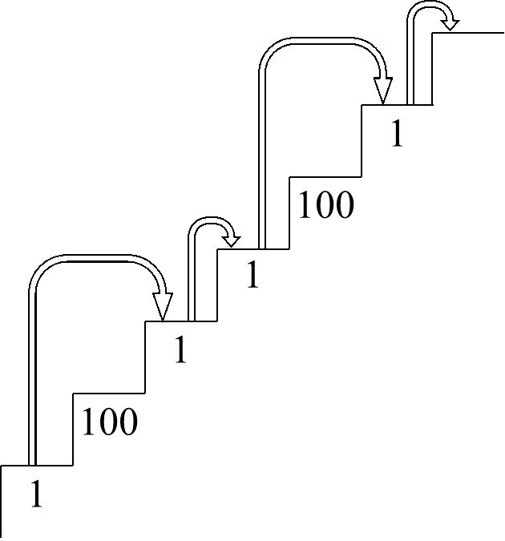
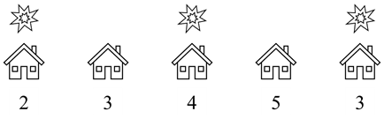
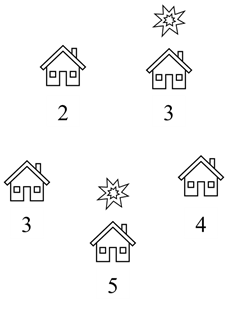
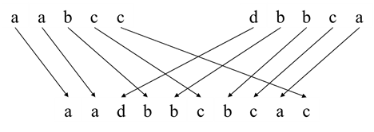
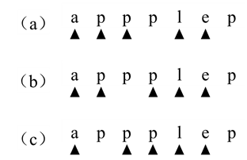
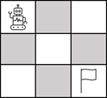
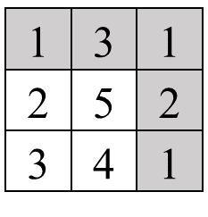
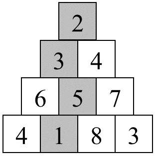

# 第十四章：动态规划
## 面试题88：爬楼梯的最少成本
### 题目
一个数组cost的所有数字都是正数，它的第i个数字表示在一个楼梯的第i级台阶往上爬的成本，在支付了成本cost[i]之后我们可以从第i级台阶往上爬1级或者2级。假设台阶至少有两级，我们可以从第0级台阶出发，也可以从第1级台阶出发，请计算爬上该楼梯的最少成本。例如输入数组[1, 100, 1, 1, 100, 1]，则爬上该楼梯的最少成本是4，分别经过下标为0、2、3、5这四级台阶，如图14.1所示。 
 


图14.1： 一个楼梯爬上每级台阶的成本用数组[1, 100, 1, 1, 100, 1]表示，爬上该台阶的最少成本为4，分别经过下标为0、2、3、5四级台阶。

### 参考代码
#### 解法一
``` java
public int minCostClimbingStairs(int[] cost) {
    int len = cost.length;
    int[] dp = new int[len];
    helper(cost, len - 1, dp);
    return Math.min(dp[len - 2], dp[len - 1]);
}

private void helper(int[] cost, int i, int[] dp) {
    if (i < 2) {
        dp[i] = cost[i];
    } else if (dp[i] == 0) {
        helper(cost, i - 2, dp);
        helper(cost, i - 1, dp);
        dp[i] = Math.min(dp[i - 2], dp[i - 1]) + cost[i];
    }
}
```

#### 解法二
``` java
public int minCostClimbingStairs(int[] cost) {
    int len = cost.length;
    int[] dp = new int[len];
    dp[0] = cost[0];
    dp[1] = cost[1];

    for (int i = 2; i < len; i++) {
        dp[i] = Math.min(dp[i - 2], dp[i - 1]) + cost[i];
    }

    return Math.min(dp[len - 2], dp[len - 1]);
}
```

#### 解法三
``` java
public int minCostClimbingStairs(int[] cost) {
    int[] dp = new int[]{cost[0], cost[1]};
    for (int i = 2; i < cost.length; i++) {
        dp[i % 2] = Math.min(dp[0], dp[1]) + cost[i];
    }
    
    return Math.min(dp[0], dp[1]);
}
```

## 面试题89：房屋偷盗
### 题目
输入一个数组表示某条街上的一排房屋内财产的数量。如果这条街道上相邻的两家被盗就会自动触发报警系统。一个小偷打算到给街去偷窃，请计算该小偷最多能偷到多少财产。例如，街道上五家的财产用数组[2, 3, 4, 5, 3]表示，如果小偷到下标为1、2和4的房屋内偷窃，那么他能偷取到价值9的财物，这是他在不触发报警系统情况下能偷取到的最多的财物，如图14.3所示。
 


图14.3： 一条街道上有5个财产数量分别为2、3、4、5、3的家庭。一个小偷到这条街道上偷东西，如果他不能到相邻的两家盗窃，那么他最多只能偷到价值为9的财物。被盗的房屋上方用特殊符号标出。

### 参考代码
#### 解法一
``` java
public int rob(int[] nums) {
    if (nums.length == 0) {
        return 0;
    }

    int[] dp = new int[nums.length];
    Arrays.fill(dp, -1);

    helper(nums, nums.length - 1, dp);
    return dp[nums.length - 1];
}

private void helper(int[]nums, int i, int[] dp) {
    if (i == 0) {
        dp[i] = nums[0];
    } else if (i == 1) {
        dp[i] = Math.max(nums[0], nums[1]);
    } else if (dp[i] < 0) {
        helper(nums, i - 2, dp);
        helper(nums, i - 1, dp);
        dp[i] = Math.max(dp[i - 1], dp[i - 2] + nums[i]);
    }
}
```

#### 解法二
``` java
public int rob(int[] nums) {
    if (nums.length == 0) {
        return 0;
    }

    int[] dp = new int[nums.length];
    dp[0] = nums[0];

    if (nums.length > 1) {
        dp[1] = Math.max(nums[0], nums[1]);
    }

    for (int i = 2; i < nums.length; i++) {
        dp[i] = Math.max(dp[i - 1], dp[i - 2] + nums[i]);
    }

    return dp[nums.length - 1];
}
```

#### 解法三
``` java
public int rob(int[] nums) {
    if (nums.length == 0) {
        return 0;
    }

    int[] dp = new int[2];
    dp[0] = nums[0];

    if (nums.length > 1) {
        dp[1] = Math.max(nums[0], nums[1]);
    }

    for (int i = 2; i < nums.length; i++) {
        dp[i%2] = Math.max(dp[(i-1) % 2], dp[(i-2) % 2] + nums[i]);
    }

    return dp[(nums.length-1)%2];
}
```

#### 解法四
``` java
public int rob(int[] nums) {
    int len = nums.length;
    if (len == 0) {
        return 0;
    }

    int[][] dp = new int[2][2];
    dp[0][0] = 0;
    dp[1][0] = nums[0];

    for (int i = 1; i < len; i++) {
        dp[0][i % 2] = Math.max(dp[0][(i-1) % 2], dp[1][(i-1) % 2]);
        dp[1][i % 2] = nums[i] + dp[0][(i-1) % 2];
    }

    return Math.max(dp[0][(len - 1) % 2], dp[1][(len - 1) % 2]);
}
```

## 面试题90：环形房屋偷盗
### 题目
一个环形街道上有若干房屋。输入一个数组表示该街上的房屋内财产的数量。如果这条街道上相邻的两家被盗就会自动触发报警系统。一个小偷打算到给街去偷窃，请计算该小偷最多能偷到多少财产。例如，街道上五家的财产用数组[2, 3, 4, 5, 3]表示，如果小偷到下标为1和3的房屋内偷窃，那么他能偷取到价值8的财物，这是他在不触发报警系统情况下能偷取到的最多的财物，如图14.4所示。
 


图14.4： 一条环形街道上有5个财产数量分别为2、3、4、5、3的家庭。一个小偷到这条街道上偷东西，如果他不能到相邻的两家盗窃，那么他最多只能偷到价值为8的财物。被盗的房屋上方用特殊符号标出。

### 参考代码
``` java
public int rob(int[] nums) {
    if (nums.length == 0) {
        return 0;
    }

    if (nums.length == 1) {
        return nums[0];
    }

    int result1 = helper(nums, 0, nums.length - 2);
    int result2 = helper(nums, 1, nums.length - 1);
    return Math.max(result1, result2);        
}

private int helper(int[] nums, int start, int end) {
    int[] dp = new int[2];
    dp[0] = nums[start];

    if (start < end) {
        dp[1] = Math.max(nums[start], nums[start + 1]);
    }

    for (int i = start + 2; i <= end; i++) {
        int j = i - start;
        dp[j%2] = Math.max(dp[(j-1) % 2], dp[(j-2) % 2] + nums[i]);
    }

    return dp[(end - start) % 2];
}
```

## 面试题91：粉刷房子
### 题目
一排n幢房子要粉刷成红、绿、蓝三种颜色，不同房子粉刷成不同颜色的成本不同。用一个n×3的数组表示n幢房子分别用三种颜色粉刷的成本。要求任意相邻的两幢房子的颜色都不一样，请计算粉刷这n幢的最少成本。例如，粉刷3幢房子的成本分别为[[17, 2, 16], [15, 14, 5], [13, 3, 1]]，如果分别将这3幢房子粉刷成绿色、蓝色和绿色，那么粉刷的成本是10，是最小的成本。

### 参考代码
``` java
public int minCost(int[][] costs) {
    if (costs.length == 0) {
        return 0;
    }

    int[][] dp = new int[3][2];
    for (int j = 0; j < 3; j++) {
        dp[j][0] = costs[0][j];
    }

    for (int i = 1; i < costs.length; i++) {
        for (int j = 0; j < 3; j++) {
            int prev1 = dp[(j + 2) % 3][(i - 1) % 2];
            int prev2 = dp[(j + 1) % 3][(i - 1) % 2];
            dp[j][i % 2] = Math.min(prev1, prev2) + costs[i][j];
        }
    }

    int last = (costs.length - 1) % 2;
    return Math.min(dp[0][last], Math.min(dp[1][last], dp[2][last]));
}
```

## 面试题92：翻转字符
### 题目
输入一个只包含和'0'的'1'字符串，我们可以将其中的'0'的翻转成'1'，可以将'1'翻转成'0'。请问至少需要翻转几个字符，使得翻转之后的字符串中所有的'0'位于'1'的前面？翻转之后的字符串可能只含有'0'或者'1'。例如，输入字符串"00110"，至少需要翻转1个字符才能使所有的'0'位于'1'的前面。我们可以将最后一个字符'0'的翻转成'1'，得到字符串"00111"。

### 参考代码
``` java
public int minFlipsMonoIncr(String S) {
    int len = S.length();
    if (len == 0) {
        return 0;
    }

    int[][] dp = new int[2][2];
    char ch = S.charAt(0);
    dp[0][0] = ch == '0' ? 0 : 1;
    dp[1][0] = ch == '1' ? 0 : 1;

    for (int i = 1; i < len; i++) {
        ch = S.charAt(i);
        int prev0 = dp[0][(i - 1) % 2];
        int prev1 = dp[1][(i - 1) % 2];
        dp[0][i % 2] = prev0 + (ch == '0' ? 0 : 1);
        dp[1][i % 2] = Math.min(prev0, prev1) + (ch == '1' ? 0 : 1);
    }

    return Math.min(dp[0][(len - 1) % 2], dp[1][(len - 1) % 2]);
}
```

## 面试题93：最长斐波那契数列
### 题目
输入一个没有重复数字的单调递增的数组，数组里至少有三个数字，请问数组里最长的斐波那契序列的长度是多少？例如，如果输入的数组是[1, 2, 3, 4, 5, 6, 7, 8]，由于其中最长的斐波那契序列是1、2、3、5、8，因此输出是5。

### 参考代码
``` java
public int lenLongestFibSubseq(int[] A) {
    Map<Integer, Integer> map = new HashMap<>();
    for (int i = 0; i < A.length; i++) {
        map.put(A[i], i);
    }

    int[][] dp = new int[A.length][A.length];
    int result = 2;
    for (int i = 1; i < A.length; i++) {
        for (int j = 0; j < i; j++) {
            int k = map.getOrDefault(A[i] - A[j], -1);
            dp[i][j] = k >= 0 && k < j ? dp[j][k] + 1 : 2;

            result = Math.max(result, dp[i][j]);
        }
    }

    return result > 2 ? result : 0;
}
```

## 面试题94：最少回文分割
### 题目
输入一个字符串，请问至少需要分割几次使得分割出的每一个子字符串都是回文？例如，输入字符串"aaba"，至少需要分割1次，从两个相邻字符'a'中间切一刀将字符串分割成2个回文子字符串"a"和"aba"。

### 参考代码
``` java
public int minCut(String s) {
    int len = s.length();
    boolean[][] isPal = new boolean[len][len];
    for (int i = 0; i < len; i++) {
        for (int j = 0; j <= i; j++) {
            char ch1 = s.charAt(i);
            char ch2 = s.charAt(j);
            if (ch1 == ch2 && (i <= j + 1 || isPal[j + 1][i - 1])) {
                isPal[j][i] = true;
            }
        }
    }

    int[] dp = new int[len];
    for (int i = 0; i < len; i++) {
        if (isPal[0][i]) {
            dp[i] = 0;
        } else {
            dp[i] = i;
            for (int j = 1; j <= i; j++) {
                if (isPal[j][i]) {
                    dp[i] = Math.min(dp[i], dp[j - 1] + 1);
                }
            }
        }
    }

    return dp[len - 1];
}
```

## 面试题95：最长公共子序列
### 题目
输入两个字符串，求出它们的最长公共子序列的长度。如果从字符串s1中删除若干个字符之后能得到字符串s2，那么s2就是s1的一个子序列。例如，从字符串"abcde"中删除两个字符之后能得到字符串"ace"，因此"ace"是"abcde"的一个子序列。但字符串"aec"不是"abcde"的子序列。如果输入字符串"abcde"和"badfe"，它们的最长公共子序列是"bde"，因此输出3。

### 参考代码
#### 解法一
``` java
public int longestCommonSubsequence(String text1, String text2) {
    int len1 = text1.length();
    int len2 = text2.length();
    int[][] dp = new int[len1 + 1][len2 + 1];
    for (int i = 0; i < len1; i++) {
        for (int j = 0; j < len2; j++) {
            if (text1.charAt(i) == text2.charAt(j)) {
                dp[i+1][j+1] = dp[i][j] + 1;
            } else {
                dp[i+1][j+1] = Math.max(dp[i][j+1], dp[i+1][j]);
            }
        }
    }

    return dp[len1][len2];
}
```

#### 解法二
``` java
public int longestCommonSubsequence(String text1, String text2) {
    int len1 = text1.length();
    int len2 = text2.length();
    if (len1 < len2) {
        return longestCommonSubsequence(text2, text1);
    }

    int[][] dp = new int[2][len2 + 1];
    for (int i = 0; i < len1; i++) {
        for (int j = 0; j < len2; j++) {
            if (text1.charAt(i) == text2.charAt(j)) {
                dp[(i+1)%2][j+1] = dp[i%2][j] + 1;
            } else {
                dp[(i+1)%2][j+1] = Math.max(dp[i%2][j+1],
                                            dp[(i+1)%2][j]);
            }
        }
    }

    return dp[len1%2][len2];
}
```

#### 解法三
``` java
public int longestCommonSubsequence(String text1, String text2) {
    int len1 = text1.length();
    int len2 = text2.length();
    if (len1 < len2) {
        return longestCommonSubsequence(text2, text1);
    }

    int[] dp = new int[len2 + 1];
    for (int i = 0; i < len1; i++) {
        int prev = dp[0];
        for (int j = 0; j < len2; j++) {
            int cur;
            if (text1.charAt(i) == text2.charAt(j)) {
                cur = prev + 1;
            } else {
                cur = Math.max(dp[j], dp[j + 1]);
            }

            prev = dp[j + 1];
            dp[j + 1] = cur;
        }
    }

    return dp[len2];        
}
```

## 面试题96：字符串交织
### 题目
输入三个字符串s1、s2、s3，请判断s3能不能由s1和s2交织而成，即s3的所有字符都是s1或s2的字符，s1和s2的字符都出现在s3中且相对位置不变。例如"aadbbcbcac"可以由"aabcc"和"dbbca"交织而成，如图14.5所示。
 


图14.5：一种交织"aabcc"和"dbbca"得到"aadbbcbcac"的方法。

### 参考代码
#### 解法一
``` java
public boolean isInterleave(String s1, String s2, String s3) {
    if (s1.length() + s2.length() != s3.length()) {
        return false;
    }

    boolean[][] dp = new boolean[s1.length() + 1][s2.length() + 1];
    dp[0][0] = true;

    for (int i = 0; i < s1.length(); i++) {
        dp[i + 1][0] = s1.charAt(i) == s3.charAt(i) && dp[i][0];
    }

    for (int j = 0; j < s2.length(); j++) {
        dp[0][j + 1] = s2.charAt(j) == s3.charAt(j) && dp[0][j];
    }

    for (int i = 0; i < s1.length(); i++) {
        for (int j = 0; j < s2.length(); j++) {
            char ch1 = s1.charAt(i);
            char ch2 = s2.charAt(j);
            char ch3 = s3.charAt(i + j + 1);
            dp[i + 1][j + 1] = (ch1 == ch3 && dp[i][j + 1])
                || ( ch2 == ch3 && dp[i + 1][j]);
        }
    }

    return dp[s1.length()][s2.length()];
}
```

#### 解法二
``` java
public boolean isInterleave(String s1, String s2, String s3) {
    if (s1.length() + s2.length() != s3.length()) {
        return false;
    }

    if (s1.length() < s2.length()) {
        return isInterleave(s2, s1, s3);
    }

    boolean[] dp = new boolean[s2.length() + 1];
    dp[0] = true;

    for (int j = 0; j < s2.length(); j++) {
        dp[j + 1] = s2.charAt(j) == s3.charAt(j) && dp[j];
    }

    for (int i = 0; i < s1.length(); i++) {
        dp[0] = dp[0] && s1.charAt(i) == s3.charAt(i);

        for (int j = 0; j < s2.length(); j++) {
            char ch1 = s1.charAt(i);
            char ch2 = s2.charAt(j);
            char ch3 = s3.charAt(i + j + 1);
            dp[j + 1] = (ch1 == ch3 && dp[j + 1])
                || ( ch2 == ch3 && dp[j]);
        }
    }

    return dp[s2.length()];
}
```

## 面试题97：子序列的数目
### 题目
输入字符串S和T，请计算S有多少个子序列等于T。例如，在字符串"appplep"中，有三个子序列等于字符串"apple"，如图14.6所示。 
 

 
图14.6：字符串"appplep"中有三个子序列等于"apple"。

### 参考代码
#### 解法一
``` java
public int numDistinct(String s, String t) {
    int[][] dp = new int[s.length() + 1][t.length() + 1];
    dp[0][0] = 1;

    for (int i = 0; i < s.length(); i++) {
        dp[i + 1][0] = 1;
        for (int j = 0; j <= i && j < t.length(); j++) {
            if (s.charAt(i) == t.charAt(j)) {
                dp[i + 1][j + 1] = dp[i][j] + dp[i][j + 1];
            } else {
                dp[i + 1][j + 1] = dp[i][j + 1];
            }
        }
    }

    return dp[s.length()][t.length()];
}
```

#### 解法二
``` java
public int numDistinct(String s, String t) {
    int[] dp = new int[t.length() + 1];
    if (s.length() > 0) {
        dp[0] = 1;
    }

    for (int i = 0; i < s.length(); i++) {
        for (int j = Math.min(i, t.length() - 1); j >= 0; j--) {
            if (s.charAt(i) == t.charAt(j)) {
                dp[j + 1] += dp[j];
            }
        }
    }

    return dp[t.length()];
}
```

## 面试题98：路径的数目
### 题目
一个机器人从m×n的格子的左上角出发，它每一步要么向下要么向右直到抵达格子的右下角。请计算机器人从左上角到达右下角的路径的数目。例如，如果格子的大小是3×3，那么机器人有6中符合条件的不同路径从左上角走到右下角，如图14.7所示。
 

 
图14.7：机器人在3×3的格子每一步只能向下或者向右，它从左上角到右下角有6条不同的路径。

### 参考代码
#### 解法一
``` java
public int uniquePaths(int m, int n) {
    int[][] dp = new int[m][n];
    return helper(m - 1, n - 1, dp);
}

private int helper(int i, int j, int[][] dp) {
    if (dp[i][j] == 0) {
        if (i == 0 || j == 0) {
            dp[i][j] = 1;
        } else {
            dp[i][j] = helper(i - 1, j, dp) + helper(i, j - 1, dp);
        }
    }

    return dp[i][j];
}
```

#### 解法二
``` java
public int uniquePaths(int m, int n) {
    int[][] dp = new int[m][n];
    Arrays.fill(dp[0], 1);
    for (int i = 1; i < m; i++) {
        dp[i][0] = 1;
    }

    for (int i = 1; i < m; i++) {
        for (int j = 1; j < n; j++) {
            dp[i][j] = dp[i][j - 1] + dp[i-1][j];
        }
    }

    return dp[m - 1][n - 1];
}
```

#### 解法三
``` java
    public int uniquePaths(int m, int n) {
        int[] dp = new int[n];
        Arrays.fill(dp, 1);
        
        for (int i = 1; i < m; i++) {
            for (int j = 1; j < n; j++) {
                dp[j] += dp[j - 1];
            }
        }
        
        return dp[n - 1];
    }
```

## 面试题99：最小路径之和
### 题目
在一个m×n（m、n均大于0）的格子里每个位置都有一个数字。一个机器人每一步只能向下或者向右，请计算它从格子的左上角到右下角的路径的数字之和的最小值。例如，从图14.8中3×3的格子的左上角到右下角的路径的数字之和的最小值是8。
 

 
图14.8：机器人在3×3的格子中每一步只能向下或者向右，它从左上角右下角的路径的数字之和为8。数字之和最小的路径用灰色背景表示。

### 参考代码
#### 解法一
``` java
public int minPathSum(int[][] grid) {
    int[][] dp = new int[grid.length][grid[0].length];
    dp[0][0] = grid[0][0];
    for (int j = 1; j < grid[0].length; j++) {
        dp[0][j] = grid[0][j] + dp[0][j - 1];
    }

    for (int i = 1; i < grid.length; i++) {
        dp[i][0] = grid[i][0] + dp[i - 1][0];
        for (int j = 1; j < grid[0].length; j++) {
            int prev = Math.min(dp[i - 1][j], dp[i][j - 1]);
            dp[i][j] = grid[i][j] + prev;
        }
    }

    return dp[grid.length - 1][grid[0].length - 1];
}
```

#### 解法二
``` java
public int minPathSum(int[][] grid) {
    int[] dp = new int[grid[0].length];
    dp[0] = grid[0][0];
    for (int j = 1; j < grid[0].length; j++) {
        dp[j] = grid[0][j] + dp[j - 1];
    }

    for (int i = 1; i < grid.length; i++) {
        dp[0] += grid[i][0];
        for (int j = 1; j < grid[0].length; j++) {
            dp[j] = grid[i][j] + Math.min(dp[j], dp[j - 1]);
        }
    }

    return dp[grid[0].length - 1];
}
```

## 面试题100：三角形中最小路径之和
### 题目
在一个由数字组成的三角形中，第一行有1个数字，第二行有2个数字，以此类推第n行有n个数字。例如图14.9是一个包含4行数字的三角形。如果每一步我们只能前往下一行中相邻的数字，请计算从三角形顶部到底部的路径经过的数字之和的最小值。例如，图14.9中三角形从顶部到底部的路径数字之和的最小值为11，对应的路径经过的数字用阴影表示。
 

 
图14.9：一个包含4行数字的三角形。从三角形的顶部到底部的路径数字之和的最小值为11，对应的路径经过的数字用阴影表示。

### 参考代码
#### 解法一
``` java
public int minimumTotal(List<List<Integer >> triangle) {
    int size = triangle.size();
    int[][] dp = new int[size][size];
    for (int i = 0; i < size; ++i) {
        for (int j = 0; j <= i; ++j) {
            dp[i][j] = triangle.get(i).get(j);
            if (i > 0 && j == 0) {
                dp[i][j] += dp[i - 1][j];
            } else if (i > 0 && i == j) {
                dp[i][j] += dp[i - 1][j - 1];
            } else if (i > 0) {
                dp[i][j] += Math.min(dp[i - 1][j], dp[i - 1][j - 1]);
            }
        }
    }

    int min = Integer.MAX_VALUE;
    for (int num : dp[size - 1]) {
        min = Math.min(min, num);
    }

    return min;
}
```

#### 解法二
``` java
public int minimumTotal(List<List<Integer>> triangle) {
    int[] dp = new int[triangle.size()];
    for (List<Integer> row : triangle) {
        for (int j = row.size() - 1; j >= 0; --j) {
            if (j == 0) {
                dp[j] += row.get(j);
            } else if (j == row.size() - 1) {
                dp[j] = dp[j - 1] + row.get(j);
            } else {
                dp[j] = Math.min(dp[j], dp[j - 1]) + row.get(j);
            }
        }
    }

    int min = Integer.MAX_VALUE;
    for (int num : dp) {
        min = Math.min(min, num);
    }

    return min;
}
```

## 面试题101：分割等和子集
### 题目
给你一个非空的正整数数组，请判断能否将这些数字分成和相等的两部分。例如，如果输入数组为[3, 4, 1]，这些数字分成[3, 1]和[4]两部分，因此输出true；如果输入数组为[1, 2, 3, 5]，则不能将这些数字分成和相等的两部分，因此输出false。

### 参考代码
#### 解法一
``` java
public boolean canPartition(int[] nums) {
    int sum = 0;
    for (int num : nums) {
        sum += num;
    }

    if (sum % 2 == 1) {
        return false;
    }

    return subsetSum(nums, sum / 2);
}

private boolean subsetSum(int[] nums, int target) {
    Boolean[][] dp = new Boolean[nums.length + 1][target + 1];
    return helper(nums, dp, nums.length, target);
}

private boolean helper(int[] nums, Boolean[][] dp, int i, int j) {
    if (dp[i][j] == null) {
        if (j == 0) {
            dp[i][j] = true;
        } else if (i == 0) {
            dp[i][j] = false;
        } else {
            dp[i][j] = helper(nums, dp, i - 1, j);
            if (!dp[i][j] && j >= nums[i - 1]) {
                dp[i][j] = helper(nums, dp, i - 1, j - nums[i - 1]);
            }
        }
    }

    return dp[i][j];
}
```

#### 解法二
``` java
public boolean canPartition(int[] nums) {
    int sum = 0;
    for (int num : nums) {
        sum += num;
    }

    if (sum % 2 == 1) {
        return false;
    }

    return subsetSum(nums, sum / 2);
}

private boolean subsetSum(int[] nums, int target) {
    boolean[][] dp = new boolean[nums.length + 1][target + 1];
    for (int i = 0; i <= nums.length; i++) {
        dp[i][0] = true;
    }

    for (int i = 1; i <= nums.length; i++) {
        for (int j = 1; j <= target; j++) {
            dp[i][j] = dp[i - 1][j];
            if (!dp[i][j] && j >= nums[i - 1]) {
                dp[i][j] =  dp[i - 1][j - nums[i - 1]];
            }
        }
    }

    return dp[nums.length][target];
}
```

#### 解法三
``` java
public boolean canPartition(int[] nums) {
    int sum = 0;
    for (int num : nums) {
        sum += num;
    }

    if (sum % 2 == 1) {
        return false;
    }

    return subsetSum(nums, sum / 2);
}

private boolean subsetSum(int[] nums, int target) {
    boolean dp[] = new boolean[target + 1];
    dp[0] = true;

    for (int i = 1; i <= nums.length; i++) {
        for (int j = target; j > 0; --j) {
            if (!dp[j] && j >= nums[i - 1]) {
                dp[j] = dp[j - nums[i - 1]];
            }
        }
    }

    return dp[target];
}
```

## 面试题102：加减的目标值
### 题目
给你一个非空的正整数数组和一个目标值S，如果给每个数字添加‘+’或者‘-’运算符，请计算有多少种方法使得这个整数的计算结果为S。例如，如果输入数组[2, 2, 2]并且S等于2，有三种添加‘+’或者‘-’的方法，使得结果为2，它们分别是2+2-2=2、2-2+2=2以及-2+2+2=2。

### 参考代码
#### 解法一
``` java
public int findTargetSumWays(int[] nums, int S) {
    int sum = 0;
    for (int num : nums) {
        sum += num;
    }

    if ((sum + S) % 2 == 1 || sum < S) {
        return 0;
    }

    return subsetSum(nums, (sum + S) / 2);
}

private int subsetSum(int[] nums, int target) {
    int dp[] = new int[target + 1];
    dp[0] = 1;

    for (int num : nums) {
        for (int j = target; j >= num; --j) {
            dp[j] += dp[j - num];
        }
    }

    return dp[target];
}
```

## 面试题103：最少的硬币数目
### 题目
给你正整数数组coins表示硬币的面额和一个目标总额t，请计算凑出总额t至少需要的硬币数目。每种硬币可以使用任意多枚。如果不能用输入的硬币凑出给定的总额，则返回-1。例如，如果硬币的面额为[1, 3, 9, 10]，总额t为15，那么至少需要3枚硬币，即2枚面额为3的硬币以及1枚面额为9的硬币。

### 参考代码
#### 解法一
``` java
public int coinChange(int[] coins, int target) {
    int[] dp = new int[target + 1];
    Arrays.fill(dp, target + 1);
    dp[0] = 0;

    for (int coin : coins) {
        for (int j = target; j >= 1; j--) {
            for (int k = 1; k * coin <= j; k++) {
                dp[j] = Math.min(dp[j], dp[j - k * coin] + k);
            }
        }
    }

    return dp[target] > target ? -1 : dp[target];
}
```

#### 解法二
``` java
public int coinChange(int[] coins, int target) {
    int[] dp = new int[target + 1];
    for (int i = 1; i <= target; ++i) {
        dp[i] = target + 1;            
        for (int coin : coins) {
            if (i >= coin) {
                dp[i] = Math.min(dp[i], dp[i - coin] + 1);
            }
        }
    }

    return dp[target] > target ? -1 : dp[target];
}
```

## 面试题104：排列的数目
### 题目
给你一个非空的正整数数组nums和一个目标值t，数组中所有数字都是唯一的，请计算数字之和等于t的所有排列的数目。数组中的数字可以在排列中出现任意次。例如，输入数组[1, 2, 3]并且t为3，那么总共由4个排序的数字之和等于3，它们分别为{1, 1, 1}、{1, 2}、{2, 1}以及{3}。

### 参考代码
``` java
public int combinationSum4(int[] nums, int target) {
    int[] dp = new int[target + 1];
    dp[0] = 1;

    for (int i = 1; i <= target; ++i) {
        for (int num : nums) {
            if (i >= num) {
                dp[i] += dp[i - num];
            }
        }
    }

    return dp[target];
}
```
