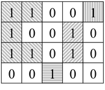
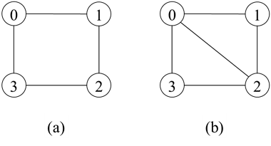
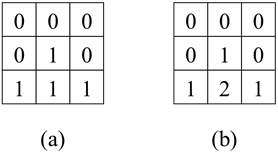
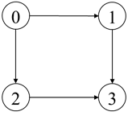
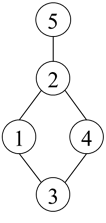

# 第十五章：图

## 面试题105：最大的岛屿
### 题目
海洋岛屿地图可以用由0、1组成的二维数组表示，水平或者竖直方向相连的一组1表示一个岛屿。请计算最大的岛屿的面积（即岛屿中1的数目）。例如，在图15.5中有4个岛屿，其中最大的岛屿的面积为5。
 


图15.5：用0、1矩阵表示的海洋岛屿地图。地图中有4个岛屿，最大的岛屿的面积为5。

### 参考代码
#### 解法一
``` java
public int maxAreaOfIsland(int[][] grid) {
    int rows = grid.length;
    int cols = grid[0].length;
    boolean[][] visited = new boolean[rows][cols];
    int maxArea = 0;
    for (int i = 0; i < rows; i++) {
        for (int j = 0; j < cols; j++) {
            if (grid[i][j] == 1 && !visited[i][j]) {
                int area = getArea(grid, visited, i, j);
                maxArea = Math.max(maxArea, area);
            }
        }
    }

    return maxArea;
}

private int getArea(int[][]grid, boolean[][] visited, int i, int j) {
    Queue<int[]> queue = new LinkedList<>();
    queue.add(new int[]{i, j});
    visited[i][j] = true;

    int[][] dirs = {{-1, 0}, {1, 0}, {0, -1}, {0, 1}};
    int area = 0;
    while (!queue.isEmpty()) {
        int[] pos = queue.remove();
        area++;

        for (int[] dir : dirs) {
            int r = pos[0] + dir[0];
            int c = pos[1] + dir[1];
            if (r >= 0 && r < grid.length
                && c >= 0 && c < grid[0].length
                && grid[r][c] == 1 && !visited[r][c]) {
                queue.add(new int[]{r, c});
                visited[r][c] = true;
            }
        }
    }

    return area;
}
```

#### 解法二
``` java
public int maxAreaOfIsland(int[][] grid) {
    int rows = grid.length;
    int cols = grid[0].length;
    boolean[][] visited = new boolean[rows][cols];
    int maxArea = 0;
    for (int i = 0; i < rows; i++) {
        for (int j = 0; j < cols; j++) {
            if (grid[i][j] == 1 && !visited[i][j]) {
                int area = getArea(grid, visited, i, j);
                maxArea = Math.max(maxArea, area);
            }
        }
    }

    return maxArea;
}

private int getArea(int[][]grid, boolean[][] visited, int i, int j) {
    Stack<int[]> stack = new Stack<>();
    stack.push(new int[]{i, j});
    visited[i][j] = true;

    int[][] dirs = {{-1, 0}, {1, 0}, {0, -1}, {0, 1}};
    int area = 0;
    while (!stack.isEmpty()) {
        int[] pos = stack.pop();
        area++;

        for (int[] dir : dirs) {
            int r = pos[0] + dir[0];
            int c = pos[1] + dir[1];
            if (r >= 0 && r < grid.length
                && c >= 0 && c < grid[0].length
                && grid[r][c] == 1 && !visited[r][c]) {
                stack.push(new int[]{r, c});
                visited[r][c] = true;
            }
        }
    }

    return area;
}
```

#### 解法三
``` java
public int maxAreaOfIsland(int[][] grid) {
    int rows = grid.length;
    int cols = grid[0].length;
    boolean[][] visited = new boolean[rows][cols];
    int maxArea = 0;
    for (int i = 0; i < rows; i++) {
        for (int j = 0; j < cols; j++) {
            if (grid[i][j] == 1 && !visited[i][j]) {
                int area = getArea(grid, visited, i, j);
                maxArea = Math.max(maxArea, area);
            }
        }
    }

    return maxArea;
}

    private int getArea(int[][]grid, boolean[][] visited, int i, int j) {
        int area = 1;
        visited[i][j] = true;
        int[][] dirs = {{-1, 0}, {1, 0}, {0, -1}, {0, 1}};
        for (int[] dir : dirs) {
            int r = i + dir[0];
            int c = j + dir[1];
            if (r >= 0 && r < grid.length
                && c >= 0 && c < grid[0].length
                && grid[r][c] == 1 && !visited[r][c]) {
                area += getArea(grid, visited, r, c);
            }
        }
        
        return area;
    }
```

## 面试题106：二分图
### 题目
如果能将一个图的结点分成A、B两部分，使得任意一条边的一个结点属于A另一个结点属于B，那么该图就是一个二分图。输入一个由数组graph表示的图，graph[i]里包含所有和结点i相邻的结点，请判断该图是否为二分图。例如，如果输入graph为[[1, 3], [0, 2], [1, 3], [0, 2]]，那么我们可以将结点分为{0, 2}、{1, 3}两部分，因此该图是一个二分图，如图15.7（a）所示。如果输入graph为[[1,2,3],[0,2],[0,1,3],[0,2]]，则不是一个二分图，如图15.7（b）所示。

 

图15.7：二分图与非二分图。（a）二分图。（b）不是二分图。

### 参考代码
#### 解法一
``` java
public boolean isBipartite(int[][] graph) {
    int size = graph.length;
    int[] colors = new int[size];
    Arrays.fill(colors, -1);
    for (int i = 0; i < size; ++i) {
        if (colors[i] == -1) {
            if (!setColor(graph, colors, i, 0)) {
                return false;
            }
        }
    }

    return true;
}

private boolean setColor(int[][] graph, int[] colors, int i, int color) {
    Queue<Integer> queue = new LinkedList<>();
    queue.add(i);
    colors[i] = color;
    while (!queue.isEmpty()) {
        int v = queue.remove();
        for (int neighbor : graph[v]) {
            if (colors[neighbor] >= 0) {
                if (colors[neighbor] == colors[v]) {
                    return false;
                }
            } else {
                queue.add(neighbor);
                colors[neighbor] = 1 - colors[v];
            }
        }
    }

    return true;
}
```
#### 解法二
``` java
public boolean isBipartite(int[][] graph) {
    int size = graph.length;
    int[] colors = new int[size];
    Arrays.fill(colors, -1);
    for (int i = 0; i < size; ++i) {
        if (colors[i] == -1) {
            if (!setColor(graph, colors, i, 0)) {
                return false;
            }
        }
    }

    return true;
}

private boolean setColor(int[][] graph, int[] colors, int i, int color) {
    if (colors[i] >= 0) {
        return colors[i] == color;
    }

    colors[i] = color;
    for (int neighbor : graph[i]) {
        if (!setColor(graph, colors, neighbor, 1 - color)) {
            return false;
        }
    }

    return true;
}
```

## 面试题107：矩阵中的距离
### 题目
输入一个有0、1组成的矩阵M，请输出一个大小相同的矩阵D，矩阵D中的每个格子是M中对应格子离最近的0的距离。水平或者竖直方向相邻两个格子的距离为1。假设矩阵M中至少要有一个0。例如，图15.8（a）是一个只包含0、1的矩阵M，它每个格子离最近的0的距离如15.8（b）的矩阵D所示。矩阵M[0][0]等于0，因此它离最近的0的距离是0，所以D[0][0]等于0。M[2][1]等于1，离它最近的0的坐标是(0, 1)、(1, 0)、(1, 2)，它们离坐标(2, 1)的距离都是2，所以D[2][1]等于2。



图15.8：矩阵中离0最近的距离。（a）一个只包含0、1的矩阵。（b）每个格子为（a）中矩阵相应位置离最近的0的距离。

### 参考代码
``` java
public int[][] updateMatrix(int[][] matrix) {
    int rows = matrix.length;
    int cols = matrix[0].length;
    int[][] dists = new int[rows][cols];
    Queue<int[]> queue = new LinkedList<>();
    for (int i = 0; i < rows; ++i) {
        for (int j = 0; j < cols; ++j) {
            if (matrix[i][j] == 0) {
                queue.add(new int[]{i, j});
                dists[i][j] = 0;
            } else {
                dists[i][j] = Integer.MAX_VALUE;
            }
        }
    }

    int[][] dirs = {{-1, 0}, {1, 0}, {0, -1}, {0, 1}};
    while (!queue.isEmpty()) {
        int[] pos = queue.remove();
        int dist = dists[pos[0]][pos[1]];
        for (int[] dir : dirs) {
            int r = pos[0] + dir[0];
            int c = pos[1] + dir[1];
            if (r >= 0 && c >= 0 && r < rows && c < cols) {
                if (dists[r][c] > dist + 1) {
                    dists[r][c] = dist + 1;
                    queue.add(new int[]{r, c});
                }
            }
        }
    }

    return dists;
}
```

## 面试题108：单词演变
### 题目
输入两个长度相同但内容不同的单词（beginWord和endWord）和一个单词列表，请问从beginWord到endWord的演变序列的最短长度，要求每一步只能改变单词中的一个字母，并且演变过程中每一步得到的单词都必须在给定的单词列表中。如果不能从beginWord演变到endWord，则返回0。假设所有单词只包含英文的小写字母。例如，如果beginWord为"hit"，endWord为"cog"，单词列表为["hot", "dot", "dog", "lot", "log", "cog"]，则演变序列的最短长度为5，一个可行的演变序列为"hit"→"hot"→"dot"→"dog"→"cog"。

### 参考代码
#### 解法一
``` java
public int ladderLength(String beginWord, String endWord, List<String> wordList) {
    Queue<String> queue1 = new LinkedList<>();
    Queue<String> queue2 = new LinkedList<>();
    Set<String> notVisited = new HashSet<>(wordList);
    int length = 1;
    queue1.add(beginWord);
    while (!queue1.isEmpty()) {
        String word = queue1.remove();
        if (word.equals(endWord)) {
            return length;
        }

        List<String> neighbors = getNeighbors(word);
        for (String neighbor : neighbors) {
            if (notVisited.contains(neighbor)) {
                queue2.add(neighbor);
                notVisited.remove(neighbor);
            }
        }

        if (queue1.isEmpty()) {
            length++;
            queue1 = queue2;
            queue2 = new LinkedList<>();
        }
    }

    return 0;
}

private List<String> getNeighbors(String word) {
    List<String> neighbors = new LinkedList<>();
    char[] chars = word.toCharArray();
    for (int i = 0; i < chars.length; ++i) {
        char old = chars[i];
        for (char ch = 'a'; ch <= 'z'; ++ch) {
            if (old != ch) {
                chars[i] = ch;
                neighbors.add(new String(chars));
            }
        }

        chars[i] = old;
    }

    return neighbors;
}
```
#### 解法二
``` java
public int ladderLength(String beginWord, String endWord, List<String> wordList) {
    Set<String> notVisited = new HashSet<>(wordList);
    if (!notVisited.contains(endWord)) {
        return 0;
    }

    Set<String> set1 = new HashSet<>();
    Set<String> set2 = new HashSet<>();
    int length = 2;
    set1.add(beginWord);
    set2.add(endWord);
    notVisited.remove(endWord);
    while (!set1.isEmpty() && !set2.isEmpty()) {
        if (set2.size() < set1.size()) {
            Set<String> temp = set1;
            set1 = set2;
            set2 = temp;
        }

        Set<String> set3 = new HashSet<>();
        for (String word : set1) {
            List<String> neighbors = getNeighbors(word);
            for (String neighbor : neighbors) {
                if (set2.contains(neighbor)) {
                    return length;
                }

                if (notVisited.contains(neighbor)) {
                    set3.add(neighbor);
                    notVisited.remove(neighbor);
                }
            }
        }

        length++;
        set1 = set3;
    }

    return 0;
}

private List<String> getNeighbors(String word) {
    List<String> neighbors = new LinkedList<>();
    char[] chars = word.toCharArray();
    for (int i = 0; i < chars.length; ++i) {
        char old = chars[i];
        for (char ch = 'a'; ch <= 'z'; ++ch) {
            if (old != ch) {
                chars[i] = ch;
                neighbors.add(new String(chars));
            }
        }

        chars[i] = old;
    }

    return neighbors;
}
```

## 面试题109：开密码锁
### 题目
一个密码锁由四个环形转轮组成，每个转轮由0到9十个数字组成。我们每次可以上下拨动一个转轮，比如可以将  一个转轮从0拨到9，也可以从9拨到0。密码锁由若干个死锁状态，一旦四个转轮被拨到某个死锁状态，这个锁就不可能打开了。密码锁的状态可以用一个长度为4的字符串表示，字符串中每个字符对应一个转轮上的数字。输入密码锁的密码和它的所有死锁状态，请问至少需要拨动转轮多少次才能从起始状态"0000"开始打开这个密码锁？

例如，如果某个密码锁的密码是"0202"，它的死锁状态列表是["0102", "0201"]，那么至少需要拨动转轮6次才能打开这个密码锁，一个可行的开锁状态序列是"0000"→"1000"→"1100"→"1200"→"1201"→"1202"→"0202"。虽然序列"0000"→"0001"→"0002"→"0102"→"0202"更短，只需要拨动4次转轮，但它包含死锁状态"0102"，因此这是一个无效的开锁序列。

### 参考代码
``` java
public int openLock(String[] deadends, String target) {
    Set<String> dead = new HashSet<>(Arrays.asList(deadends));
    Set<String> visited = new HashSet<>();
    String init = "0000";
    if (dead.contains(init) || dead.contains(target)) {
        return -1;
    }

    Queue<String> queue1 = new LinkedList<>();
    Queue<String> queue2 = new LinkedList<>();
    int steps = 0;
    queue1.offer(init);
    visited.add(init);
    while (!queue1.isEmpty()) {
        String cur = queue1.remove();
        if (cur.equals(target)) {
            return steps;
        }

        List<String> nexts = getNeighbors(cur);
        for (String next : nexts) {
            if (!dead.contains(next) && !visited.contains(next)) {
                visited.add(next);
                queue2.add(next);
            }
        }

        if (queue1.isEmpty()) {
            steps++;
            queue1 = queue2;
            queue2 = new LinkedList<>();
        }
    }

    return -1;
}
```

## 面试题110：所有路径
### 题目
一个有向无环图由n个结点（标号从0到n-1，n≥2）组成，请找出所有从结点0到结点n-1的所有路径。图用一个数组graph表示，数组的graph[i]包含所有从结点i能直接到达的结点。例如，输入数组graph为[[1,2], [3], [3], []]，则输出两条从结点0到结点3的路径，分别为0→1→3和0→2→3，如图15.12所示。



图15.12：一个有4个结点的有向无环图。从结点0到结点3有两条不同的路径，分别为0→1→3和0→2→3。

### 参考代码
``` java
public List<List<Integer>> allPathsSourceTarget(int[][] graph) {
    List<List<Integer>> result = new LinkedList<>();
    List<Integer> path = new LinkedList<Integer>();
    dfs(0, graph, path, result);

    return result;
}

private void dfs(int source, int[][] graph, List<Integer> path, List<List<Integer>> result) {
    path.add(source);
    if (source == graph.length - 1) {
        result.add(new LinkedList<Integer>(path));
    } else {
        for (int next : graph[source]) {
            dfs(next, graph, path, result);
        }
    }

    path.remove(path.size() - 1);
}    
```

## 面试题111：计算除法
### 题目
输入两个数组equations和values，其中数组equations的每一个元素包含两个表示变量名的字符串，数组values的每个元素是一个浮点数值。如果equations[i]的两个变量名分别是Ai和Bi，那么Ai/Bi=values[i]。再给你一个数组queries，它的每个元素也包含两个变量名。假设任意values[i]大于0。对于queries[j]的两个变量名为Cj和Dj，请计算Cj/Dj的结果。如果不能计算，那么返回-1。

例如，输入数组equations为[["a", "b"], ["b", "c"]]，数组values为[2.0, 3.0]，如果queries为[["a", "c"], ["b", "a"], ["a", "e"], ["a", "a"], ["x", "x"]]，那么对应的计算结果为[6.0, 0.5, -1.0, 1.0, -1.0]。由equations我们知道a/b=2.0、b/c=3.0，所以a/c=6.0、b/a=0.5、a/a=1.0。

### 参考代码
``` java
public double[] calcEquation(List<List<String>> equations, double[] values, List<List<String>> queries) {
    Map<String, Map<String, Double>> graph = buildGraph(equations, values);
    double[] results = new double[queries.size()];
    for (int i = 0; i < queries.size(); ++i) {
        String from = queries.get(i).get(0);
        String to = queries.get(i).get(1);
        if (!graph.containsKey(from) || !graph.containsKey(to)) {
            results[i] = -1;
        } else {
            Set<String> visited = new HashSet<>();
            results[i] = dfs(graph, from, to, visited);
        }
    }

    return results;
}

private Map<String, Map<String, Double>> buildGraph(List<List<String>> equations, double[] values) {
    Map<String, Map<String, Double>> graph = new HashMap<>();
    for (int i = 0; i < equations.size(); i++) {
        String var1 = equations.get(i).get(0);
        String var2 = equations.get(i).get(1);

        graph.putIfAbsent(var1, new HashMap<String, Double>());
        graph.get(var1).put(var2, values[i]);

        graph.putIfAbsent(var2, new HashMap<String, Double>());
        graph.get(var2).put(var1, 1.0/ values[i]);
    }

    return graph;
}

private double dfs(Map<String, Map<String, Double>> graph, String from, String to, Set<String> visited) {
    if (from.equals(to)) {
        return 1.0;
    }

    visited.add(from);
    for (Map.Entry<String, Double> entry : graph.get(from).entrySet()) {
        String next = entry.getKey();
        if (!visited.contains(next)) {
            double nextValue = dfs(graph, next, to, visited);
            if (nextValue > 0) {
                return entry.getValue() * nextValue;
            }
        }
    }

    visited.remove(from);
    return -1.0;
}
```

## 面试题112：最长递增路径
### 题目
输入一个有整数组成的矩阵，请找出最长递增路径的长度。矩阵中的路径可以沿着上、下、左、右四个方向前行。例如，图15.10中矩阵的最长递增路径的长度为4，其中一条最长的递增路径为3→4→5→8，如阴影部分所示。 


图15.15：矩阵中的路径可以沿着上、下、左、右四个方向前行，其中一条最长的递增路径为3→4→5→8（阴影部分），它的长度为4。

### 参考代码
``` java
public int longestIncreasingPath(int[][] matrix) {
    if (matrix.length == 0 || matrix[0].length == 0) {
        return 0;
    }

    int[][] lengths = new int[matrix.length][matrix[0].length];
    int longest = 0;
    for (int i = 0; i < matrix.length; ++i) {
        for (int j = 0; j < matrix[0].length; ++j) {
            int length = dfs(matrix, lengths, i, j);
            longest = Math.max(longest, length);
        }
    }

    return longest;
}

private int dfs(int[][] matrix, int[][] lengths, int i, int j) {
    if (lengths[i][j] != 0) {
        return lengths[i][j];
    }

    int rows = matrix.length;
    int cols = matrix[0].length;
    int[][] dirs = {{-1, 0}, {0, -1}, {1, 0}, {0, 1}};
    int length = 1;
    for (int[] dir : dirs) {
        int r = i + dir[0];
        int c = j + dir[1];
        if (r >= 0 && r < rows && c >= 0 && c < cols 
            && matrix[r][c] > matrix[i][j]) {
            int path = dfs(matrix, lengths, r, c);
            length = Math.max(path + 1, length);
        }
    }

    lengths[i][j] = length;
    return length;
} 
```

## 面试题113：课程顺序
### 题目
n门课程的编号从0到n-1。输入一个数组prerequisites，它的每个元素prerequisites[i]表示两门课程的先修顺序。如果prerequisites[i]=[ai, bi]，那么我们必须先修完可以bi才能修ai。请根据总课程数n和表示先修顺序的prerequisites得出一个可行的修课序列。如果有多个可行的修课序列，则输出任意序列。如果没有可行的修课序列，则输出空序列。例如，总共有4门课程，先修顺序prerequisites为[[1, 0], [2, 0], [3, 1], [3, 2]]，一个可行的修课序列是0→2→1→3。

### 参考代码
``` java
public int[] findOrder(int numCourses, int[][] prerequisites) {
    Map<Integer, List<Integer>> graph = new HashMap<>();
    for (int i = 0; i < numCourses; i++) {
        graph.put(i, new LinkedList<Integer>());
    }

    int[] inDegrees = new int[numCourses];
    for (int[] prereq : prerequisites) {
        graph.get(prereq[1]).add(prereq[0]);
        inDegrees[prereq[0]]++;
    }

    Queue<Integer> queue = new LinkedList<>();
    for (int i = 0; i < numCourses; ++i) {
        if (inDegrees[i] == 0) {
            queue.add(i);
        }
    }

    List<Integer> order = new LinkedList<>();
    while (!queue.isEmpty()) {
        int course = queue.remove();
        order.add(course);
        for (int next : graph.get(course)) {
            inDegrees[next]--;
            if (inDegrees[next] == 0) {
                queue.add(next);
            }
        }
    }

    return order.size() == numCourses
        ? order.stream().mapToInt(i->i).toArray()
        : new int[0];
}
```

## 面试题114：外星文字典
## 题目
一种外星文语言的字母都是英文字母，但字母的顺序未知。给你该语言排序的单词列表，请推测可能的字母顺序。如果有多个可能的顺序，返回任意一个。如果没有满足条件的字母顺序，返回空字符串。例如，如果输入排序的单词列表为["ac", "ab", "bc", "zc", "zb"]，那么一个可能的字母顺序是"acbz"。

### 参考代码
``` java
public String alienOrder(String[] words) {
    Map<Character, Set<Character>> graph = new HashMap<>();
    Map<Character, Integer> inDegrees = new HashMap<>();
    for (String word : words) {
        for (char ch : word.toCharArray()) {
            graph.putIfAbsent(ch, new HashSet<Character>());
            inDegrees.putIfAbsent(ch, 0);
        }
    }

    for (int i = 1; i < words.length; i++) {
        String w1 = words[i - 1];
        String w2 = words[i];
        if (w1.startsWith(w2) && !w1.equals(w2)) {
            return "";
        }

        for (int j = 0; j < w1.length() && j < w2.length(); j++) {
            char ch1 = w1.charAt(j);
            char ch2 = w2.charAt(j);
            if (ch1 != ch2) {
                if (!graph.get(ch1).contains(ch2)) {
                    graph.get(ch1).add(ch2);
                    inDegrees.put(ch2, inDegrees.get(ch2) + 1);
                }

                break;
            }
        }
    }

    Queue<Character> queue = new LinkedList<>();
    for (char ch : inDegrees.keySet()) {
        if (inDegrees.get(ch) == 0) {
            queue.add(ch);
        }
    }

    StringBuilder sb = new StringBuilder();
    while (!queue.isEmpty()) {
        char ch = queue.remove();
        sb.append(ch);
        for (char next : graph.get(ch)) {
            inDegrees.put(next, inDegrees.get(next) - 1);
            if (inDegrees.get(next) == 0) {
                queue.add(next);
            }
        }
    }

    return sb.length() == graph.size() ? sb.toString() : "";
}
```

## 面试题115：重建序列
### 题目
长度为n的数组org是数字1到n的一个排列，seqs是若干个序列，请判断org是否为可由seqs重建的唯一序列。重建是指在seqs 中构建最短的公共超序列，即seqs 中的任意序列都是该最短序列的子序列。

例如，如果数组org为[4, 1, 5, 2, 6, 3]，而seqs为[[5, 2, 6, 3], [4, 1, 5, 2]]，因为用[[5, 2, 6, 3], [4, 1, 5, 2]]可以重建出唯一的序列[4, 1, 5, 2, 6, 3]，因此返回true。如果数组org为[1, 2, 3]，而seqs为[[1, 2], [1, 3]]，因为用[[1, 2], [1, 3]]可以重建出两个序列，[1, 2, 3]或者[1, 3, 2]，因此返回false。

### 参考代码
``` java
public boolean sequenceReconstruction(int[] org, List<List<Integer>> seqs) {
    Map<Integer, Set<Integer>> graph = new HashMap<>();
    Map<Integer, Integer> inDegrees = new HashMap<>();
    for (List<Integer> seq : seqs) {
        for (int num : seq) {
            if (num < 1 || num > org.length) {
                return false;
            }

            graph.putIfAbsent(num, new HashSet<>());
            inDegrees.putIfAbsent(num, 0);
        }

        for (int i = 0; i < seq.size() - 1; i++) {
            int num1 = seq.get(i);
            int num2 = seq.get(i + 1);
            if (!graph.get(num1).contains(num2)) {
                graph.get(num1).add(num2);
                inDegrees.put(num2, inDegrees.get(num2) + 1);
            }
        }
    }

    Queue<Integer> queue = new LinkedList<>();
    for (int num : inDegrees.keySet()) {
        if (inDegrees.get(num) == 0) {
            queue.add(num);
        }
    }

    List<Integer> built = new LinkedList<>();
    while (queue.size() == 1) {
        int num = queue.remove();
        built.add(num);            
        for (int next : graph.get(num)) {
            inDegrees.put(next, inDegrees.get(next) - 1);
            if (inDegrees.get(next) == 0) {
                queue.add(next);
            }
        }
    }

    int[] result = new int[built.size()];
    result = built.stream().mapToInt(i->i).toArray();        
    return Arrays.equals(result, org);
}
```

## 面试题116：朋友圈
### 题目
假设一个班上有n个同学。同学之间有些是朋友，有些不是。朋友关系是可以传递的。比如A是B的直接朋友，B是C的直接朋友，那么A是C的间接朋友。我们定义朋友圈就是一组直接或间接朋友的同学。输入一个n×n的矩阵M表示班上的朋友关系，如果M[i][j]=1,那么同学i和同学j是直接朋友。请计算该班朋友圈的数目？
例如输入数组[[1, 1, 0], [1, 1, 0], [0, 0, 1]]，则表明同学0和同学1是朋友，他们组成一个朋友圈。同学2一个人组成一个朋友圈。因此朋友圈的数目是2。

### 参考代码
#### 解法一
``` java
public int findCircleNum(int[][] M) {
    boolean[] visited = new boolean[M.length];
    int result = 0;
    for (int i = 0; i < M.length; i++) {
        if (!visited[i]) {
            findCircle(M, visited, i);
            result++;
        }
    }

    return result;
}

private void findCircle(int[][] M, boolean[]visited, int i) {
    Queue<Integer> queue = new LinkedList<>();
    queue.add(i);
    visited[i] = true;
    while(!queue.isEmpty()) {
        int t = queue.remove();
        for (int friend = 0; friend < M.length; friend++) {
            if (M[t][friend] == 1 && !visited[friend]) {
                queue.add(friend);
                visited[friend] = true;
            }
        }
    }
}
```
#### 解法二
``` java
public int findCircleNum(int[][] M) {
    int[] fathers = new int[M.length];
    for (int i = 0; i < fathers.length; ++i) {
        fathers[i] = i;
    }

    int count = M.length;
    for (int i = 0; i < M.length; ++i) {
        for (int j = i + 1; j < M.length; ++j) {
            if (M[i][j] == 1 && union(fathers, i, j)) {
                count--;
            }
        }
    }

    return count;
}

private int findFather(int[] fathers, int i) {
    if (fathers[i] != i) {
        fathers[i] = findFather(fathers, fathers[i]);
    }

    return fathers[i];
}

private boolean union(int[] fathers, int i, int j) {
    int fatherOfI = findFather(fathers, i);
    int fatherOfJ = findFather(fathers, j);
    if (fatherOfI != fatherOfJ) {
        fathers[fatherOfI] = fatherOfJ;
        return true;
    }

    return false;
}
```

## 面试题117：相似的字符串
### 题目
如果交换字符串X中的两个字符能得到字符串Y，那么两个字符串X和Y相似。例如字符串"tars"和"rats"相似（交换下标0和2的两个字符）、字符串"rats"和"arts"相似（交换下标0和1的字符），但字符串"star"和"tars"不相似。

输入一个字符串数组，根据字符串的相似性分组，请问能把输入数组分成几组？如果一个字符串至少和一组字符串中的一个相似，那么它就可以放到该组里去。假设输入数组中的所有字符串长度相同并且两两互为变位词。例如输入数组["tars","rats","arts","star"]，可以分成2组，一组为{"tars", "rats", "arts"}，另一组为{"star"}。

### 参考代码
``` java
public int numSimilarGroups(String[] A) {
    int[] fathers = new int[A.length];
    for (int i = 0; i < fathers.length; ++i) {
        fathers[i] = i;
    }

    int groups = A.length;
    for (int i = 0; i < A.length; ++i) {
        for (int j = i + 1; j < A.length; ++j) {
            if (similar(A[i], A[j]) && union(fathers, i, j)) {
                groups--;
            }
        }
    }

    return groups;
}

private int findFather(int[] fathers, int i) {
    if (fathers[i] != i) {
        fathers[i] = findFather(fathers, fathers[i]);
    }

    return fathers[i];
}

private boolean union(int[] fathers, int i, int j) {
    int fatherOfI = findFather(fathers, i);
    int fatherOfJ = findFather(fathers, j);
    if (fatherOfI != fatherOfJ) {
        fathers[fatherOfI] = fatherOfJ;
        return true;
    }

    return false;
}
```

## 面试题118：多余的边
### 题目
树可以看成是无环的无向图。在一个含有n个结点（结点标号从1到n）的树中添加一条边，就变成一个有环的图。给你一个往树里添加了一条边的图，请找出这条多余的边（用该边连接的两个结点表示）。输入的图由一个二维数组edges表示，数组的每个元素是由一条边连接的两个结点[u, v]（u<v）。如果有多个答案，请输出在数组edges中最后出现的边。

例如，如果输入edges为[[1, 2], [1, 3], [2, 4], [3, 4], [2, 5]]，则它对应的无向图如图15.22所示。输出为边[3, 4]。


 
图15.22：由边列表[[1, 2], [1, 3], [2, 4], [3, 4], [2, 5]]构成的图。

### 参考代码
``` java
public int[] findRedundantConnection(int[][] edges) {
    int maxVertex = 0;
    for (int[] edge : edges) {
        maxVertex = Math.max(maxVertex, edge[0]);
        maxVertex = Math.max(maxVertex, edge[1]);
    }

    int[] fathers = new int[maxVertex + 1];
    for (int i = 1; i <= maxVertex; ++i) {
        fathers[i] = i;
    }

    for (int[] edge : edges) {
        if (!union(fathers, edge[0], edge[1])) {
            return edge;
        }
    }

    return new int[2];
}

private int findFather(int[] fathers, int i) {
    if (fathers[i] != i) {
        fathers[i] = findFather(fathers, fathers[i]);
    }

    return fathers[i];
}

private boolean union(int[] fathers, int i, int j) {
    int fatherOfI = findFather(fathers, i);
    int fatherOfJ = findFather(fathers, j);
    if (fatherOfI != fatherOfJ) {
        fathers[fatherOfI] = fatherOfJ;
        return true;
    }

    return false;
}
```

## 面试题119：最长连续序列

### 题目
输入一个无序的整数数组，请计算最长的连续数值序列的长度。例如，输入数组[10, 5, 9, 2, 4, 3]，则最长的连续数值序列是[2, 3, 4, 5]，因此输出4。

### 参考代码
#### 解法一
``` java
public int longestConsecutive(int[] nums) {
    Set<Integer> set = new HashSet<>();
    for (int num : nums) {
        set.add(num);
    }

    int longest = 0;
    while (!set.isEmpty()) {
        Iterator<Integer> iter = set.iterator();
        longest = Math.max(longest, bfs(set, iter.next()));
    }

    return longest;
}

private int bfs(Set<Integer> set, int num) {
    Queue<Integer> queue = new LinkedList<>();
    queue.offer(num);
    set.remove(num);
    int length = 1;
    while (!queue.isEmpty()) {
        int i = queue.poll();
        int[] neighbors = new int[] {i - 1, i + 1};
        for (int neighbor : neighbors) {
            if (set.contains(neighbor)) {
                queue.offer(neighbor);
                set.remove(neighbor);
                length++;
            }
        }
    }

    return length;
}
```

#### 解法二
``` java
public int longestConsecutive(int[] nums) {
    Map<Integer, Integer> fathers = new HashMap<>();
    Map<Integer, Integer> counts = new HashMap<>();
    Set<Integer> all = new HashSet<>();
    for (int num : nums) {
        fathers.put(num, num);
        counts.put(num, 1);
        all.add(num);
    }

    for (int num : nums) {
        if (all.contains(num + 1)) {
            union(fathers, counts, num, num + 1);
        }

        if (all.contains(num - 1)) {
            union(fathers, counts, num, num - 1);
        }
    }

    int longest = 0;
    for (int length : counts.values()) {
        longest = Math.max(longest, length);
    }

    return longest;
}

private int findFather(Map<Integer, Integer> fathers, int i) {
    if (fathers.get(i) != i) {
        fathers.put(i, findFather(fathers, fathers.get(i)));
    }

    return fathers.get(i);
}

private void union(Map<Integer, Integer> fathers, Map<Integer, Integer> counts, int i, int j) {
    int fatherOfI = findFather(fathers, i);
    int fatherOfJ = findFather(fathers, j);
    if (fatherOfI != fatherOfJ) {
        fathers.put(fatherOfI, fatherOfJ);

        int countOfI = counts.get(fatherOfI);
        int countOfJ = counts.get(fatherOfJ);
        counts.put(fatherOfJ, countOfI + countOfJ);
    }
}
```
